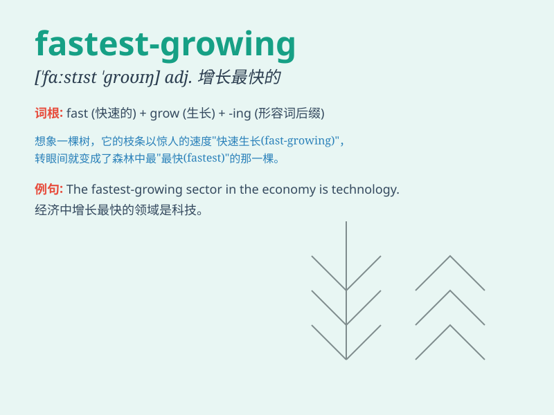

## fastest-growing

**英音:** _[ˈfɑːstɪst ˈɡroʊɪŋ]_ **美音:** _[ˈfæstɪst
ˈɡroʊɪŋ]_

**译义:** *adj. 增长最快的；发展最快的*

### 短语

+ **fastest-growing industry:** _增长最快的行业_

+ **fastest-growing market:** _增长最快的市场_

+ **fastest-growing sector:** _增长最快的部门_

+ **fastest-growing region:** _增长最快的地区_

+ **fastest-growing economy:** _增长最快的经济体_

### 例句

#### 例句1

> **The technology sector is one of the fastest-growing industries in
the world.**

**中文翻译:** 科技行业是世界上增长最快的行业之一。

**单词释义:** 增长最快的

#### 例句2

> **This company has become the fastest-growing start-up in the
region.**

**中文翻译:** 这家公司已成为该地区增长最快的初创企业。

**单词释义:** 增长最快的

#### 例句3

> **The fastest-growing segment of the market is for eco-friendly
products.**

**中文翻译:** 市场中增长最快的部分是环保产品。

**单词释义:** 增长最快的

### 背诵小故事

> Once upon a time, there was a magical plant that was the
fastest-growing one in the forest. It grew so fast that everyone was
amazed. It showed how powerful and special \'fastest-growing\' can be.

**从前，在森林里有一株神奇的植物，它是生长最快的。它长得如此之快，让所有人都感到惊讶。这展示了'fastest-growing'（最快生长的）的强大和特别。**

### 图义

