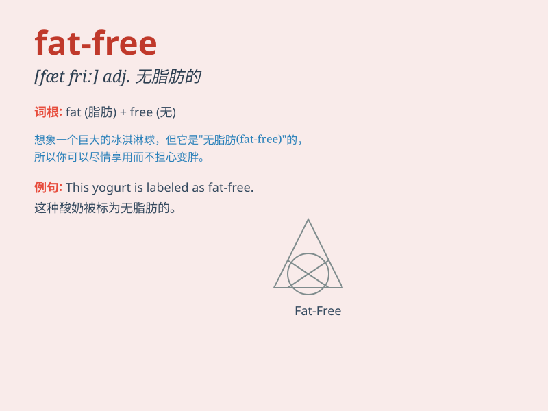

## fat-free

**英音:** _[fæt friː]_ **美音:** _[fæt friː]_

**译义:** *adj. 无脂肪的，不含脂肪的；无脂肪含量的*

### 短语

+ **fat-free diet:** _无脂肪饮食_

+ **fat-free milk:** _脱脂牛奶_

+ **fat-free yogurt:** _脱脂酸奶_

+ **fat-free cheese:** _脱脂奶酪_

+ **fat-free dressing:** _无脂调味料_

### 例句

#### 例句1

> **I always choose fat-free yogurt for a healthier option.**

**中文翻译:** 为了更健康，我总是选择脱脂酸奶。

**单词释义:** 不含脂肪的

#### 例句2

> **The supermarket offers a wide range of fat-free products.**

**中文翻译:** 这家超市提供各种各样的脱脂产品。

**单词释义:** 无脂肪的

#### 例句3

> **She prefers to drink fat-free milk instead of regular milk.**

**中文翻译:** 她更喜欢喝脱脂牛奶而不是普通牛奶。

**单词释义:** 脱脂的

### 背诵小故事

> Once upon a time, a girl was on a diet. She was looking for food that
was fat-free. Finally, she found some fat-free yogurt and was very
happy. It helped her stay healthy and fit.

**从前，有个女孩在节食。她在寻找无脂肪的食物。最后，她找到了一些无脂肪的酸奶，非常高兴。这帮助她保持健康和苗条。**

### 图义

