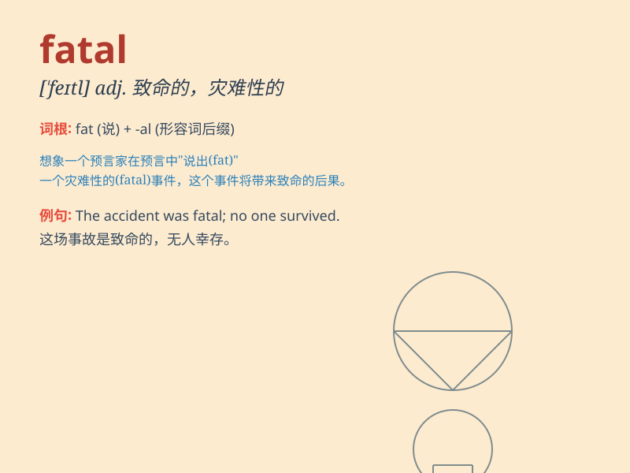

## fatal

**英音:** _[\'feɪt(ə)l]_ **美音:** _[\'fetl]_

**译义:** *adj.致命的,重大的,命运注定的,不幸的,致命的,毁灭性的*

### 短语

+ **fatal accident:** _致命事故_

+ **fatal disease:** _绝症_

+ **fatal error:** _致命错误_

+ **fatal blow:** _致命一击_

+ **fatal attraction:** _致命的吸引力_

### 例句

#### 例句1

> **The accident was fatal. **

**中文翻译:** 事故是致命的。

**单词释义:** 致命的

#### 例句2

> **His mistake proved fatal to the project. **

**中文翻译:** 他的错误对这个项目来说是致命的。

**单词释义:** 致命的；毁灭性的

#### 例句3

> **A fatal disease has attacked him. **

**中文翻译:** 一种致命的疾病袭击了他。

**单词释义:** 致命的

### 背诵小故事

> A brave adventurer was exploring a mysterious cave. Unknowingly, he
stepped on a hidden trap. This one step proved fatal as the cave started
to collapse. Luckily, he was rescued at the last moment.

**一位勇敢的探险家正在探索一个神秘的洞穴。不知不觉中，他踩到了一个隐藏的陷阱。这一步被证明是致命的，因为洞穴开始崩塌。幸运的是，他在最后一刻获救了。**

### 图义

