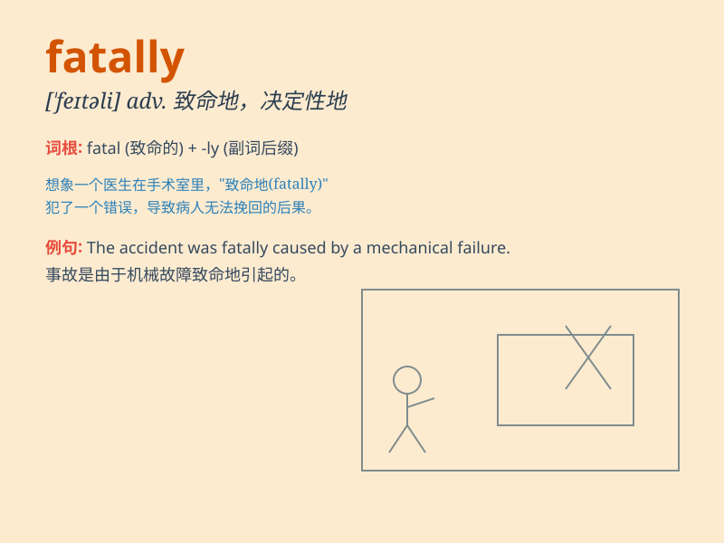

## fatally

**英音:** _[\'feɪtəli]_ **美音:** _[\'feɪtəli]_

**译义:** *adv.致命地,宿命地,不幸地*

### 短语

+ **fatally wounded:** _受致命伤_

+ **fatally flawed:** _存在致命缺陷_

+ **fatally ill:** _身患绝症_

+ **fatally attractive:** _致命的吸引力_

+ **fatally dependent:** _极度依赖_

### 例句

#### 例句1

> **The accident fatally injured three people.**

**中文翻译:** 事故造成三人死亡。

**单词释义:** 致命地

#### 例句2

> **He was fatally flawed as a leader.**

**中文翻译:** 作为一个领导者，他有致命的缺陷。

**单词释义:** 致命地；无可挽回地

#### 例句3

> **The disease spread fatally throughout the region.**

**中文翻译:** 这种疾病在整个地区蔓延，造成致命的后果。

**单词释义:** 致命地

### 背诵小故事

> A brave detective was chasing a criminal. Unfortunately, he was shot
fatally. But his spirit remained, inspiring others to fight for justice.
The word \'fatally\' means causing death or having a deadly effect.

**一位勇敢的侦探在追捕罪犯。不幸的是，他受到了致命的枪击。但他的精神留存下来，激励着其他人去为正义而战。单词\'fatally\'意思是致命地；灾难性地**

### 图义

