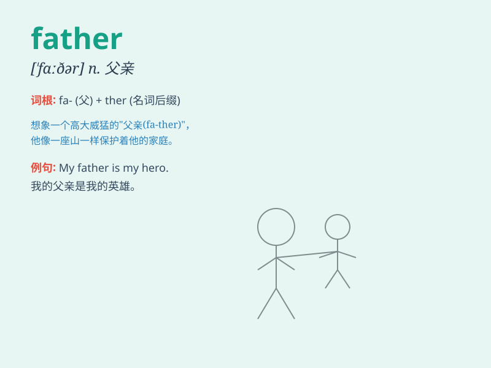

## father

**英音:** _[\'fɑːðə]_ **美音:** _[\'fɑðɚ]_

**译义:**
*n.父亲,岳父,公(丈夫的父亲),祖先,前辈,长辈,神父,创始者vt.当\...的父亲,保护,创立,治理,发明,培养*

### 短语

+ **father figure:** _长者；父亲般的人物；权威人物_

+ **father-in-law:** _岳父；公公_

+ **like father, like son:** _有其父必有其子_

+ **founding father:** _开国元勋；创建人_

+ **father Christmas:** _圣诞老人_

### 例句

#### 例句1

> **My father is a doctor.**

**中文翻译:** 我的父亲是一名医生。

**单词释义:** 父亲

#### 例句2

> **I look like my father.**

**中文翻译:** 我看起来像我的父亲。

**单词释义:** 父亲

#### 例句3

> **Father often tells me stories at night.**

**中文翻译:** 父亲经常在晚上给我讲故事。

**单词释义:** 父亲

### 背诵小故事

> A little boy was lost in a big forest. He was scared and cried. Then
a strong man came and held his hand. The man was his father. Father
means the one who protects and loves you always.

**一个小男孩在大森林里迷路了。他很害怕并哭了起来。然后一个强壮的男人来了，握住他的手。这个男人就是他的父亲。父亲意味着永远保护和爱你的那个人。**

### 图义

