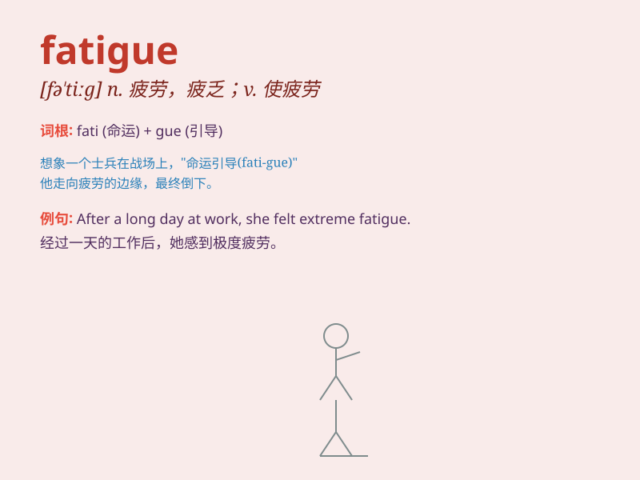

## fatigue

**英音:** _[fə\'tiːg]_ **美音:** _[fə\'tig]_

**译义:** *n.疲乏,疲劳,累活,[军]杂役vt.使疲劳,使心智衰弱vi.疲劳*

### 短语

+ **chronic fatigue:** _慢性疲劳_

+ **mental fatigue:** _精神疲劳_

+ **fatigue syndrome:** _疲劳综合征_

+ **fatigue strength:** _疲劳强度_

+ **combat fatigue:** _战斗疲劳_

### 例句

#### 例句1

> **The long journey caused him a lot of fatigue.**

**中文翻译:** 这次长途旅行让他感到非常疲劳。

**单词释义:** 疲劳；疲倦

#### 例句2

> **She was suffering from mental fatigue.**

**中文翻译:** 她正遭受精神疲劳之苦。

**单词释义:** 疲劳；劳累

#### 例句3

> **The metal fatigue led to the failure of the bridge.**

**中文翻译:** 金属疲劳导致了这座桥的垮塌。

**单词释义:** （材料、部件等的）疲劳

### 背诵小故事

> A hardworking ant carried heavy food all day, feeling extreme
fatigue. It struggled to move but kept going. Finally, it reached the
nest, knowing its effort was worth it despite the fatigue.

**一只勤劳的蚂蚁一整天都搬运着沉重的食物，感到极度疲劳。它艰难地移动但仍坚持着。最后，它到达了巢穴，尽管疲劳但知道自己的努力是值得的。**

### 图义

