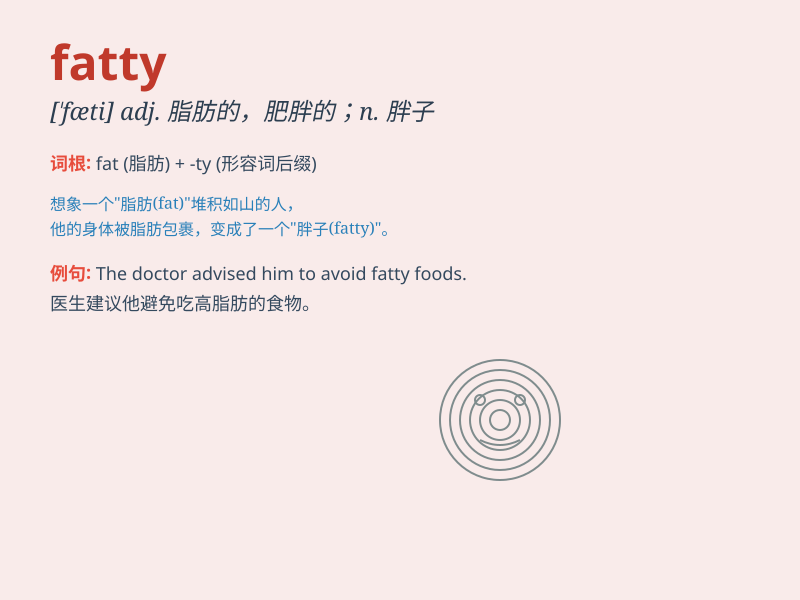

## fatty

**英音:** _[\'fætɪ]_ **美音:** _[\'fæti]_

**译义:** *adj.脂肪的,含脂肪的,脂肪状的,[医]脂肪过多n.胖子*

### 短语

+ **fatty acid:** _脂肪酸_

+ **fatty liver:** _脂肪肝_

+ **fatty tissue:** _脂肪组织_

+ **fatty food:** _高脂肪食物_

+ **fatty deposit:** _脂肪沉积_

### 例句

#### 例句1

> **Avoid eating too much fatty food to stay healthy.**

**中文翻译:** 为了保持健康，避免吃太多高脂肪的食物。

**单词释义:** 高脂肪的

#### 例句2

> **The doctor warned him about his fatty liver.**

**中文翻译:** 医生警告他关于他的脂肪肝。

**单词释义:** 脂肪多的

#### 例句3

> **She doesn\'t like the fatty taste of this cake.**

**中文翻译:** 她不喜欢这个蛋糕的油腻味道。

**单词释义:** 油腻的

### 背诵小故事

> Once upon a time, there was a little boy who loved to eat junk food.
As a result, he became very fatty. His friends laughed at him, and then
he decided to change his diet and do exercise to be healthy.

**从前，有一个小男孩特别喜欢吃垃圾食品。结果，他变得非常胖。他的朋友们都嘲笑他，于是他决定改变饮食并做运动来保持健康。**

### 图义

