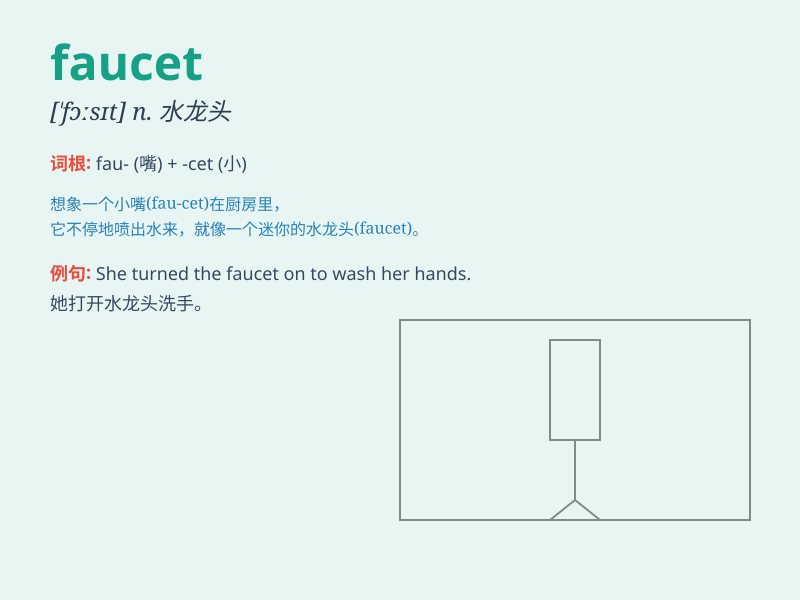

## faucet

**英音:** _[\'fɔːsɪt]_ **美音:** _[\'fɔsɪt]_

**译义:** *n.龙头,旋塞,(连接管子的)插口*

### 短语

+ **water faucet:** _水龙头_

+ **bathroom faucet:** _浴室水龙头_

+ **kitchen faucet:** _厨房水龙头_

+ **faucet handle:** _水龙头把手_

+ **leaky faucet:** _漏水的水龙头_

### 例句

#### 例句1

> **The faucet in the kitchen is leaking.**

**中文翻译:** 厨房里的水龙头在漏水。

**单词释义:** 水龙头

#### 例句2

> **She turned on the faucet to wash her hands.**

**中文翻译:** 她打开水龙头洗手。

**单词释义:** 水龙头

#### 例句3

> **The faucet of the bathtub needs to be repaired.**

**中文翻译:** 浴缸的水龙头需要修理。

**单词释义:** 水龙头

### 背诵小故事

> One day, I was very thirsty. I opened the faucet in the kitchen, and
clear water flowed out. With the help of this faucet, I quickly filled
my glass and quenched my thirst. The faucet is like a magic key to
water.

**有一天，我非常口渴。我打开厨房的水龙头，清澈的水流出。借助这个水龙头，我很快装满了杯子，解了渴。水龙头就像获取水的神奇钥匙。**

### 图义

