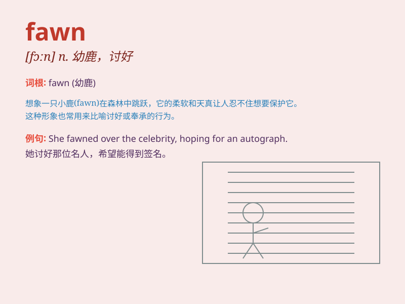

## fawn

**英音:** _[fɔːn]_ **美音:** _[fɔn]_

**译义:**
*n.(未满一岁的)小鹿,小山羊,小动物,鹿毛色,浅黄褐色vi.奉承,讨好v.生(小山羊或小动物)adj.浅黄褐色*

### 短语

+ **fawn color:** _浅黄褐色_

+ **fawn over:** _讨好；奉承；巴结_

+ **fawn puppy:** _浅黄褐色的小狗_

+ **fawn coat:** _浅黄褐色的外套_

+ **fawn eyes:** _温顺的眼神_

### 例句

#### 例句1

> **The young deer fawned on its mother for food.**

**中文翻译:** 这只小鹿向它的母亲讨好要食物。

**单词释义:** 讨好，奉承

#### 例句2

> **She always fawns over her boss to get a promotion.**

**中文翻译:** 她总是讨好她的老板以获得晋升。

**单词释义:** 讨好，巴结

#### 例句3

> **The dog fawned at the feet of its owner, hoping for a treat.**

**中文翻译:** 这只狗在主人脚边讨好，希望得到一份奖励。

**单词释义:** 讨好，摇尾乞怜

### 背诵小故事

> One day, in the forest, a little deer was born. It was a fawn. It had
big eyes and soft fur. Everyone loved its cute look. The fawn was shy
but friendly, hopping around joyfully.

**有一天，在森林里，一只小鹿出生了。它是一只幼鹿。它有着大大的眼睛和柔软的皮毛。每个人都喜欢它可爱的模样。这只幼鹿很害羞但很友好，欢快地蹦蹦跳跳。**

### 图义

