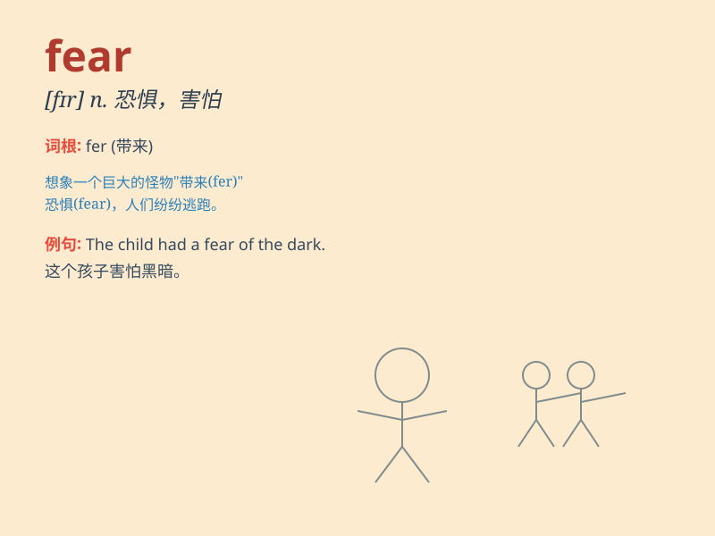

## fear

**英音:** _[fɪə]_ **美音:** _[fɪr]_

**译义:** *n.恐怖,害怕,担心,敬畏v.害怕,畏惧,为\...担心,敬畏(神等)*

### 短语

+ **in fear:** _害怕；在恐惧中_

+ **for fear of:** _唯恐；以免_

+ **fear for:** _为\...\...担心_

+ **with fear:** _带着恐惧_

+ **fear to do sth:** _害怕做某事_

### 例句

#### 例句1

> **I have a fear of heights.**

**中文翻译:** 我有恐高症。

**单词释义:** 恐惧；害怕

#### 例句2

> **She feared for her children\'s safety.**

**中文翻译:** 她担心孩子们的安全。

**单词释义:** 担心；担忧

#### 例句3

> **His fears proved unfounded.**

**中文翻译:** 事实证明他的担心是没有根据的。

**单词释义:** 恐惧；害怕

### 背诵小故事

> One night, Tom was walking alone in a dark forest. Suddenly, strange
noises surrounded him. His heart pounded fast. He felt a great FEAR. But
he took a deep breath and found his way out. Fear can be overcome!

**一天晚上，汤姆独自走在黑暗的森林里。突然，奇怪的声音包围了他。他的心跳得很快。他感到非常害怕。但他深吸一口气，找到了出去的路。恐惧是可以克服的！**

### 图义

