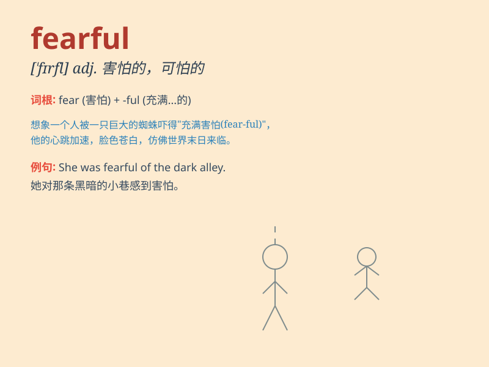

## fearful

**英音:** _[\'fɪəfʊl; -f(ə)l]_ **美音:** _[\'fɪrfəl]_

**译义:** *adj.可怕的,吓人的,恐怕的,严重的*

### 短语

+ **fearful of:** _害怕，担忧_

+ **fearful consequences:** _可怕的后果_

+ **fearful situation:** _可怕的情况_

+ **fearful experience:** _可怕的经历_

+ **fearful look:** _恐惧的表情_

### 例句

#### 例句1

> **The child was fearful of the dark.**

**中文翻译:** 这孩子害怕黑暗。

**单词释义:** 害怕的

#### 例句2

> **They were fearful that the bridge would collapse.**

**中文翻译:** 他们担心桥会垮塌。

**单词释义:** 担心的

#### 例句3

> **The doctor had a fearful look on his face.**

**中文翻译:** 医生脸上露出惊恐的表情。

**单词释义:** 惊恐的

### 背诵小故事

> One night, Tom was walking alone in a dark forest. Suddenly, he heard
strange noises. His heart pounded and he felt fearful. He didn\'t know
what was lurking in the shadows.

**一天晚上，汤姆独自走在黑暗的森林里。突然，他听到了奇怪的声音。他的心怦怦直跳，感到很害怕。他不知道阴影里潜伏着什么。**

### 图义

