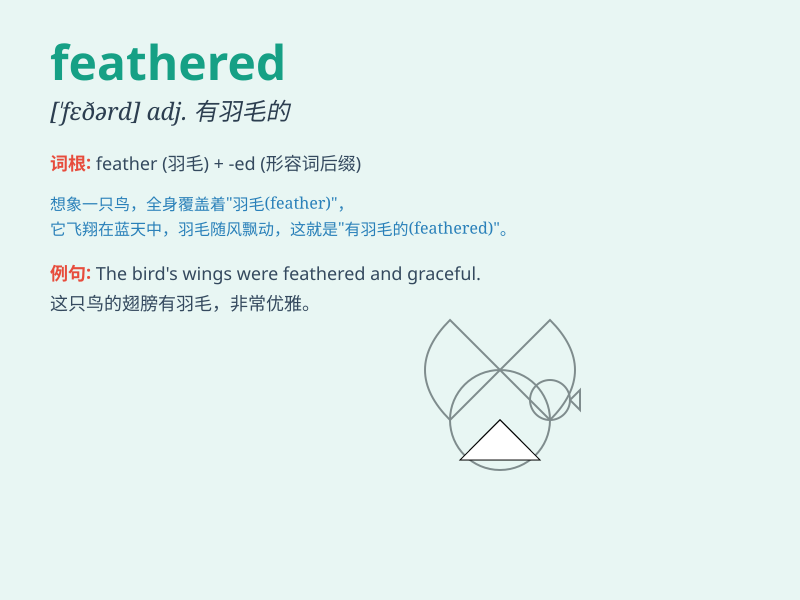

## feathered

**英音:** _[\'feðəd]_ **美音:** _[\'fɛðɚd]_

**译义:** *adj.有羽毛的,像鸟般飞得快的*

### 短语

+ **feathered friend:** _鸟（常作为对鸟的亲切称呼）_

+ **feathered arrow:** _带羽毛的箭_

+ **feathered hat:** _羽毛帽_

+ **feathered wing:** _有羽毛的翅膀_

+ **feathered creature:** _有羽毛的生物_

### 例句

#### 例句1

> **The bird has beautiful feathered wings.**

**中文翻译:** 这只鸟有美丽的有羽毛的翅膀。

**单词释义:** 有羽毛的

#### 例句2

> **She wore a feathered hat to the party.**

**中文翻译:** 她戴着一顶饰有羽毛的帽子去参加聚会。

**单词释义:** 饰有羽毛的

#### 例句3

> **The feathered arrows flew through the air.**

**中文翻译:** 那些带羽毛的箭在空中飞过。

**单词释义:** 带羽毛的

### 背诵小故事

> A little bird was lost. It had beautiful feathered wings. But it
couldn\'t fly home. Then a kind girl helped it. When the bird spread its
feathered wings again, it flew happily.

**一只小鸟迷路了。它有着美丽的有羽毛的翅膀。但它飞不回家。然后一个善良的女孩帮助了它。当小鸟再次展开它那长满羽毛的翅膀时，它快乐地飞走了。**

### 图义

