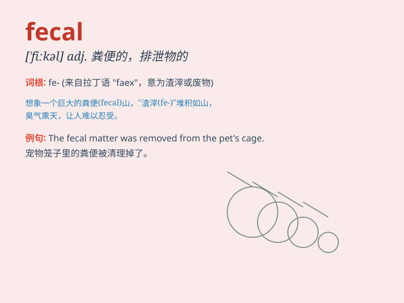

## fecal

**英音:** _[\'fiːkəl]_ **美音:** _[\'fikəl]_

**译义:** *adj.排泄物的,渣滓的,糟粕的*

### 短语

+ **fecal matter:** _粪便；排泄物_

+ **fecal incontinence:** _大便失禁_

+ **fecal sample:** _粪便样本_

+ **fecal coliform:** _粪大肠菌群_

+ **fecal odor:** _粪便气味_

### 例句

#### 例句1

> **The doctor analyzed the fecal sample for signs of infection.**

**中文翻译:** 医生分析粪便样本以寻找感染的迹象。

**单词释义:** 粪便的

#### 例句2

> **Fecal matter can contaminate water sources and cause
diseases.**

**中文翻译:** 粪便物质会污染水源并导致疾病。

**单词释义:** 粪便的

#### 例句3

> **The fecal odor was overwhelming in the small room.**

**中文翻译:** 小房间里粪便的气味令人难以忍受。

**单词释义:** 粪便的

### 背诵小故事

> One day, a scientist was studying samples in the laboratory. He found
some strange substances and labeled them as \'fecal\'. Later, he
realized these fecal matters could provide important clues for his
research.

**一天，一位科学家在实验室研究样本。他发现了一些奇怪的物质，并将其标记为"粪便的"。后来，他意识到这些粪便物质可以为他的研究提供重要线索。**

### 图义

