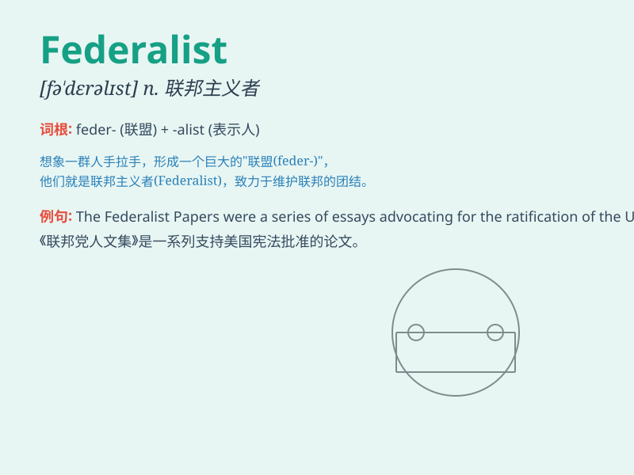

## Federalist

**英音:** _[ˈfedərəlɪst]_ **美音:** _[ˈfɛdərəlɪst]_

**译义:** *n.联邦主义者；联邦制拥护者 adj.联邦主义的*

### 短语

+ **Federalist Party:** _联邦党_

+ **Federalist Papers:** _联邦党人文集_

+ **New Federalist:** _新联邦主义者_

+ **Federalist System:** _联邦制_

+ **Anti-Federalist:** _反联邦主义者_

### 例句

#### 例句1

> **The Federalist Papers are an important part of American political
history.**

**中文翻译:** 《联邦党人文集》是美国政治历史的重要组成部分。

**单词释义:** 联邦党人的

#### 例句2

> **He is a strong advocate of Federalist principles.**

**中文翻译:** 他是联邦主义原则的坚定拥护者。

**单词释义:** 联邦主义的

#### 例句3

> **The Federalist movement gained momentum in the late 18th
century.**

**中文翻译:** 联邦主义运动在 18 世纪后期势头渐起。

**单词释义:** 联邦主义的

### 背诵小故事

> A group of friends decided to form a club. They wanted a strong and
united system, just like the Federalist idea. They worked together to
make rules that would benefit everyone. Finally, their club was
successful and harmonious.

**一群朋友决定成立一个俱乐部。他们想要一个强大且统一的体系，就像联邦主义者的理念。他们共同制定对每个人都有益的规则。最终，他们的俱乐部成功且和谐。**

### 图义

