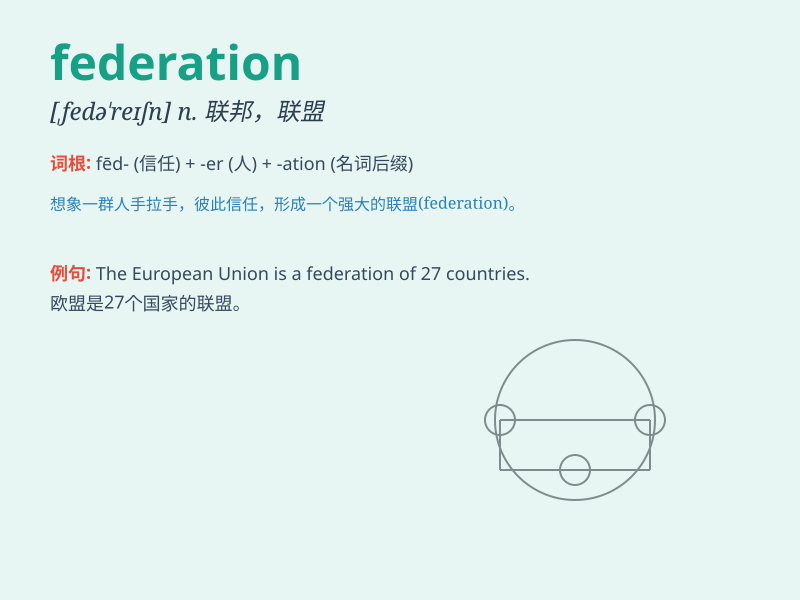

## federation

**英音:** _[fedə\'reɪʃ(ə)n]_ **美音:** _[\'fɛdə\'reʃən]_

**译义:** *n.同盟,联邦,联合,联盟*

### 短语

+ **International Federation:** _国际联合会_

+ **Federation Cup:** _联合会杯_

+ **Student Federation:** _学生联合会_

+ **Trade Federation:** _贸易联合会_

+ **Sports Federation:** _体育联合会_

### 例句

#### 例句1

> **The Federation of European Neuroscience Societies holds an annual
conference.**

**中文翻译:** 欧洲神经科学学会联合会每年都会举办一次会议。

**单词释义:** 联合会

#### 例句2

> **The Russian Federation is a large and diverse country.**

**中文翻译:** 俄罗斯联邦是一个庞大且多元化的国家。

**单词释义:** 联邦

#### 例句3

> **The sports federation has strict rules for athlete
eligibility.**

**中文翻译:** 这个体育联合会对运动员的参赛资格有严格的规定。

**单词释义:** 联合会

### 背诵小故事

> Once upon a time, there were many small kingdoms. They decided to
unite and form a federation to be stronger. They shared resources and
worked together for a common goal. Federation means a group of states or
organizations united for a common purpose.

**从前，有许多小王国。他们决定联合起来组成一个联盟以变得更强大。他们共享资源，为了一个共同的目标而共同努力。federation
意思是为了共同目的而联合在一起的一组国家或组织。**

### 图义

