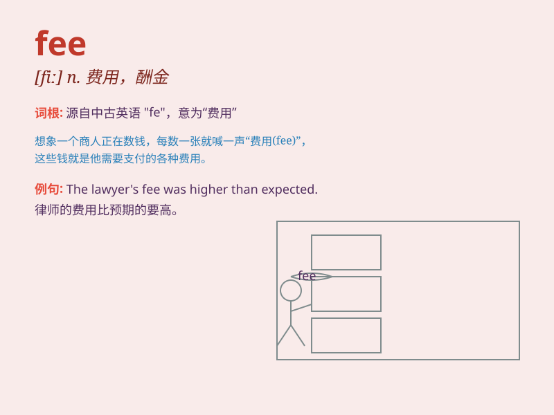

## fee

**英音:** _[fiː]_ **美音:** _[fi]_

**译义:** *n.费(会费、学费等),酬金*

### 短语

+ **registration fee:** _注册费；挂号费；登记费_

+ **admission fee:** _入场费；入会费_

+ **membership fee:** _会员费；会费_

+ **service fee:** _服务费；手续费_

+ **tuition fee:** _学费_

### 例句

#### 例句1

> **The lawyer\'s fee was very high.**

**中文翻译:** 这位律师的费用非常高。

**单词释义:** 费用

#### 例句2

> **You need to pay an admission fee to enter the museum.**

**中文翻译:** 你需要支付入场费才能进入博物馆。

**单词释义:** 费用

#### 例句3

> **The membership fee for this club is \$500 a year.**

**中文翻译:** 这个俱乐部的会员费是每年 500 美元。

**单词释义:** 费用

### 背诵小故事

> A poor student was worried about the fee for a special course. But
when he got a part-time job and earned enough money, he happily paid the
fee and learned a lot.

**一个贫困的学生为一门特殊课程的费用发愁。但当他找到一份兼职工作并赚够了钱，他高兴地支付了费用并学到了很多。**

### 图义

