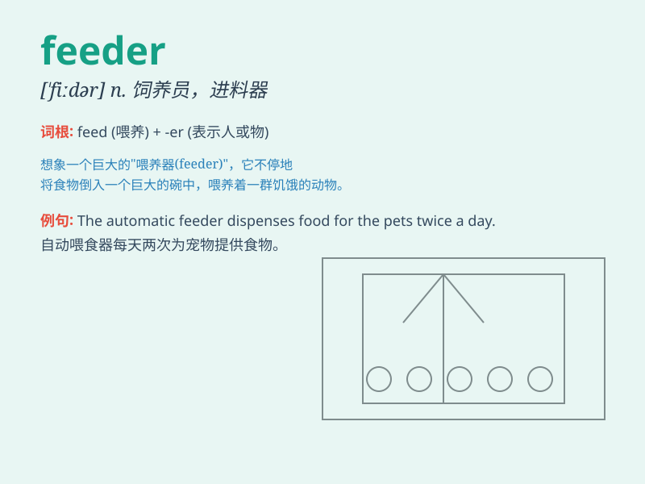

## feeder

**英音:** _[\'fiːdə]_ **美音:** _[\'fidɚ]_

**译义:** *n.饲养员,奶瓶,进料器,馈电线,支流*

### 短语

+ **bird feeder:** _鸟食槽_

+ **power feeder:** _供电馈线_

+ **vibration feeder:** _振动给料机_

+ **cattle feeder:** _牛饲料槽_

+ **wire feeder:** _送丝装置_

### 例句

#### 例句1

> **The bird feeder in the garden is always full of seeds.**

**中文翻译:** 花园里的鸟食槽总是装满了种子。

**单词释义:** 喂食器；进料器

#### 例句2

> **He is a feeder of information to the media.**

**中文翻译:** 他是向媒体提供信息的人。

**单词释义:** 提供者；供应者

#### 例句3

> **The power feeder to the building was damaged in the storm.**

**中文翻译:** 这栋大楼的电力馈线在暴风雨中受损了。

**单词释义:** 馈电线；进线

### 背诵小故事

> A little bird was very hungry. It looked everywhere for food.
Finally, it found a feeder full of grains. It happily ate and thanked
the kind person who set up the feeder.

**一只小鸟非常饿。它到处找食物。最后，它发现了一个装满谷物的喂食器。它开心地吃着，并感谢设置这个喂食器的好心人。**

### 图义

