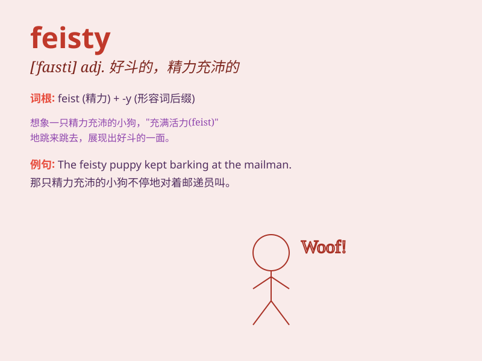

## feisty

**英音:** _[ˈfaɪsti]_ **美音:** _[ˈfaɪsti]_

**译义:** *adj.易怒的,活跃的*

### 短语

+ **feisty spirit:** _好斗的精神_

+ **feisty attitude:** _泼辣的态度_

+ **feisty personality:** _活泼好斗的个性_

+ **feisty character:** _性格泼辣_

+ **feisty mood:** _暴躁的情绪_

### 例句

#### 例句1

> **The feisty old lady refused to be pushed around.**

**中文翻译:** 这位泼辣的老太太拒绝受人摆布。

**单词释义:** 精力充沛且好斗的；泼辣的

#### 例句2

> **The feisty puppy was full of energy and playfulness.**

**中文翻译:** 这只活泼好动的小狗充满了活力和顽皮。

**单词释义:** 活泼的；精力旺盛的

#### 例句3

> **She has a feisty spirit that helps her overcome challenges.**

**中文翻译:** 她有一种勇敢的精神，帮助她克服挑战。

**单词释义:** 勇敢的；坚毅的

### 背诵小故事

> One day, a little dog was feisty. It barked loudly and fiercely at a
big dog. It showed its strong and lively spirit. No matter how big the
opponent was, it wasn\'t afraid. That\'s what \'feisty\' means.

**有一天，一只小狗很勇猛好斗。它对着一只大狗大声又凶猛地叫。它展现出了强大且活泼的精神。不管对手多大，它都不害怕。这就是\'feisty\'的意思。**

### 图义

