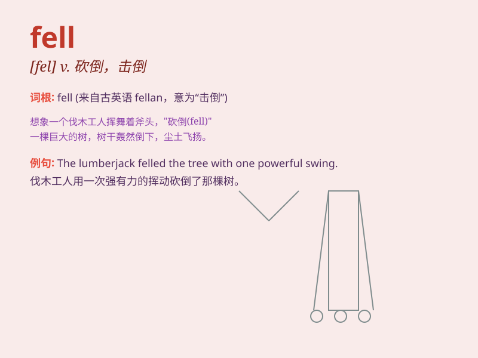

## fell

**英音:** _[fel]_ **美音:** _[fɛl]_

**译义:** * vbl.fall
的过去式vt.击倒,打倒(疾病等),致于\...死地,砍伐n.一季所伐的木材,兽皮,羊毛adj.凶猛的,可怕的*

### 短语

+ **fell down:** _摔倒；跌倒_

+ **fell off:** _从\...\...掉下来_

+ **fell asleep:** _入睡；睡着_

+ **fell in love with:** _爱上\...\..._

+ **fell ill:** _生病；病倒_

### 例句

#### 例句1

> **He fell off the bike and hurt his leg.**

**中文翻译:** 他从自行车上摔下来，伤到了腿。

**单词释义:** 摔倒；掉下

#### 例句2

> **The tree was felled by the workers.**

**中文翻译:** 这棵树被工人砍倒了。

**单词释义:** 砍伐；击倒

#### 例句3

> **She fell in love with him at first sight.**

**中文翻译:** 她对他一见钟情。

**单词释义:** 陷入；进入（某种状态）

### 背诵小故事

> Once upon a time, a brave lumberjack was in the forest. He used his
axe to fell a huge tree. It was a tough job, but he succeeded. Remember,
\'fell\' means to cut down a tree.

**从前，有一个勇敢的伐木工在森林里。他用斧头砍倒了一棵大树。这是一项艰巨的工作，但他成功了。记住，\'fell\'的意思是砍倒（树木）。**

### 图义

