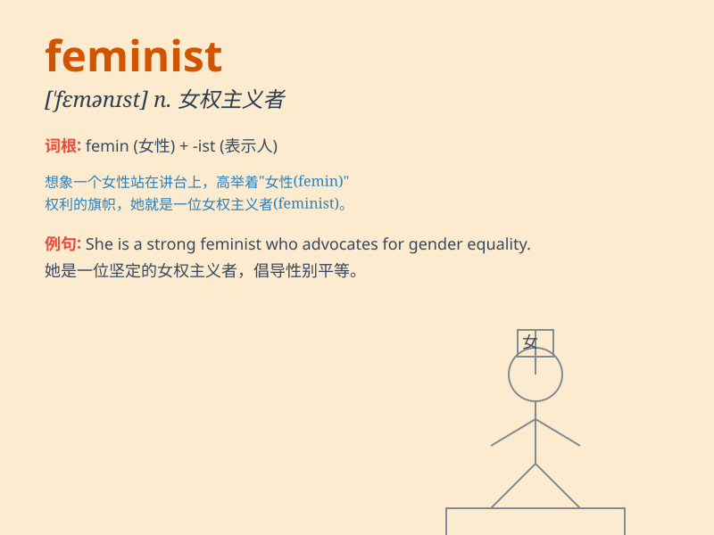

## feminist

**英音:** _[\'femənɪst]_ **美音:** _[\'fɛmənɪst]_

**译义:** *n.男女平等主义者,女权扩张论者*

### 短语

+ **radical feminist:** _激进的女权主义者_

+ **liberal feminist:** _自由派女权主义者_

+ **feminist movement:** _女权运动_

+ **feminist theory:** _女权主义理论_

+ **feminist perspective:** _女权主义视角_

### 例句

#### 例句1

> **She is a passionate feminist who fights for gender equality.**

**中文翻译:** 她是一位充满激情的女权主义者，为性别平等而奋斗。

**单词释义:** 女权主义者

#### 例句2

> **The feminist movement has made significant progress over the
years.**

**中文翻译:** 多年来，女权主义运动取得了重大进展。

**单词释义:** 女权主义的

#### 例句3

> **He doesn\'t understand the goals of the feminist cause.**

**中文翻译:** 他不理解女权主义事业的目标。

**单词释义:** 女权主义的

### 背诵小故事

> Once upon a time, there was a girl named Lily. She always fought for
women\'s rights and equality. People called her a feminist. She believed
that women should have the same opportunities as men in all aspects of
life.

**从前，有个叫莉莉的女孩。她总是为女性的权利和平等而斗争。人们称她为女权主义者。她认为女性在生活的各个方面都应该和男性有相同的机会。**

### 图义

