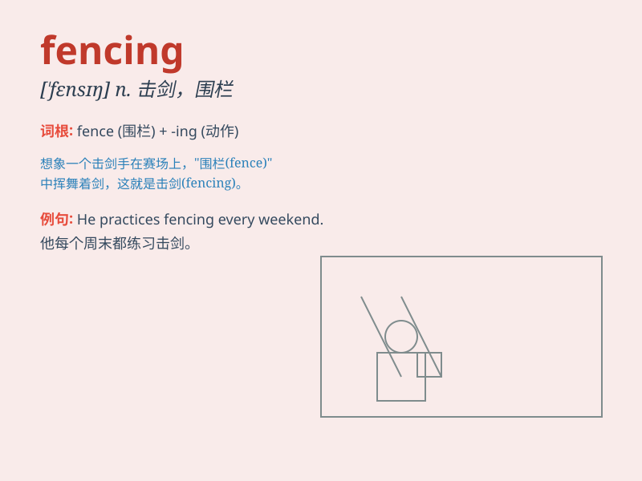

## fencing

**英音:** _[\'fensɪŋ]_ **美音:** _[\'fɛnsɪŋ]_

**译义:** *n.栅栏,篱笆,围墙,剑术,辩论,买卖*

### 短语

+ **fencing mask:** _击剑面罩_

+ **fencing club:** _击剑俱乐部_

+ **fencing foil:** _击剑箔_

+ **fencing master:** _击剑大师_

+ **fencing match:** _击剑比赛_

### 例句

#### 例句1

> **He is passionate about fencing and participates in competitions
regularly.**

**中文翻译:** 他热衷于击剑并定期参加比赛。

**单词释义:** 击剑（运动）

#### 例句2

> **The fencing around the garden needs to be repaired.**

**中文翻译:** 花园周围的栅栏需要修理。

**单词释义:** 围栏；栅栏

#### 例句3

> **Fencing is an art that requires both skill and strategy.**

**中文翻译:** 击剑是一门需要技巧和策略的艺术。

**单词释义:** 击剑

### 背诵小故事

> One day, a little boy was very interested in a sport. He saw people
wearing masks and holding swords. It was fencing. They moved quickly and
gracefully. The boy decided to learn fencing too.

**有一天，一个小男孩对一项运动很感兴趣。他看到人们戴着面具，拿着剑。这就是击剑。他们动作迅速而优雅。这个男孩也决定学习击剑。**

### 图义

