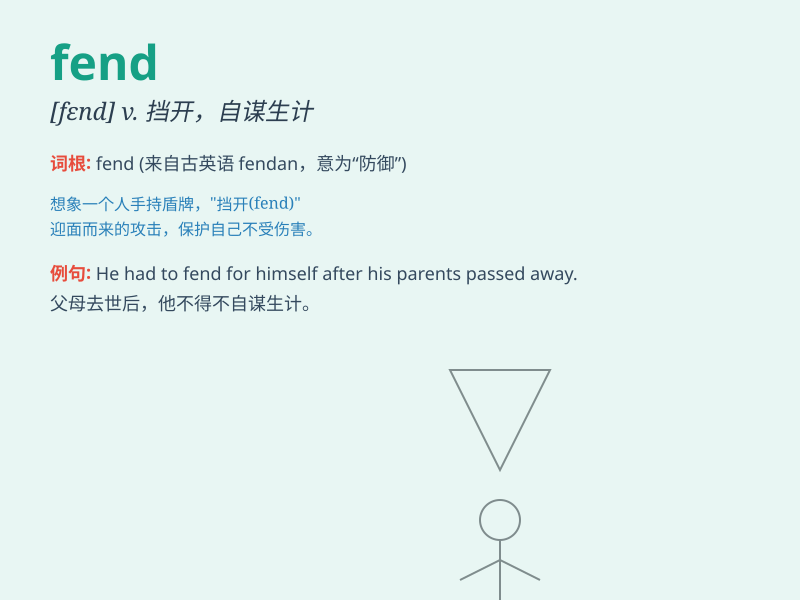

## fend

**英音:** _[fend]_ **美音:** _[fend]_

**译义:** *vt.保护,谋生,供养,挡开vi.\<英>努力,力争,供养,照料*

### 短语

+ **fend for oneself:** _照料自己；自谋生计_

+ **fend off:** _挡开；避开_

+ **fend someone/something off:** _抵御；击退；抵挡_

+ **fend against:** _抵抗；防御_

+ **fend out:** _把...赶走；驱逐_

### 例句

#### 例句1

> **He had to fend for himself from an early age.**

**中文翻译:** 他从小就必须自己照顾自己。

**单词释义:** 照料；照顾

#### 例句2

> **She managed to fend off the attacker with her umbrella.**

**中文翻译:** 她设法用雨伞挡开了袭击者。

**单词释义:** 挡开；抵挡

#### 例句3

> **The company is struggling to fend off competition from new
startups.**

**中文翻译:** 该公司正在努力抵御来自新初创公司的竞争。

**单词释义:** 抵御；击退

### 背诵小故事

> A poor little cat had to fend for itself in the wild. It learned to
hunt for food and avoid dangers all by itself. \'Fend\' means to take
care of and defend oneself.

**一只可怜的小猫不得不在野外自谋生路。它学会了自己寻找食物和躲避危险。'fend'这个单词意思是照料，保护自己。**

### 图义

