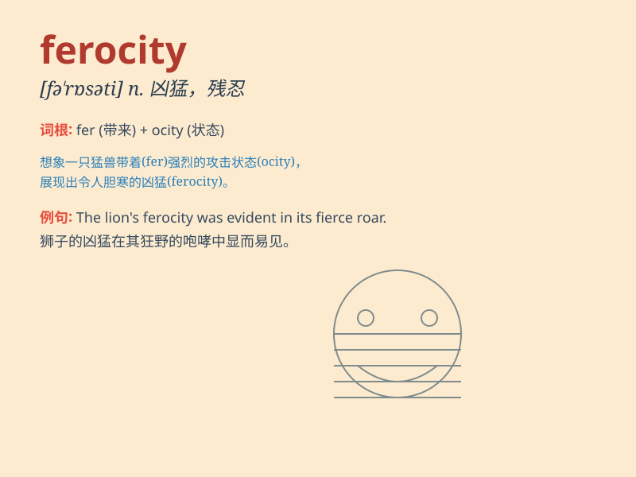

## ferocity

**英音:** _[fə\'rɒsɪtɪ]_ **美音:** _[fə\'rɑsəti]_

**译义:** *n.凶猛,残忍,暴行*

### 短语

+ **with ferocity:** _凶猛地；猛烈地_

+ **ferocity of attack:** _攻击的凶猛程度_

+ **ferocity in nature:** _本性中的凶残_

+ **unleash ferocity:** _释放凶猛；展现凶残_

+ **ferocity of the storm:** _风暴的凶猛_

### 例句

#### 例句1

> **The ferocity of the storm was unprecedented.**

**中文翻译:** 风暴的猛烈程度是前所未有的。

**单词释义:** 凶猛；残暴

#### 例句2

> **The tiger attacked with great ferocity.**

**中文翻译:** 老虎的攻击非常凶猛。

**单词释义:** 凶猛

#### 例句3

> **The ferocity of his words shocked everyone.**

**中文翻译:** 他言语之凶猛，让所有人都震惊了。

**单词释义:** 激烈；强烈

### 背诵小故事

> A fierce lion showed its ferocity in the jungle. It roared loudly and
attacked other animals with great force. Its wild and intense behavior
made all the creatures tremble.

**一只凶猛的狮子在丛林中展现出它的凶猛。它大声咆哮，并以巨大的力量攻击其他动物。它狂野和激烈的行为让所有生物都颤抖。**

### 图义

