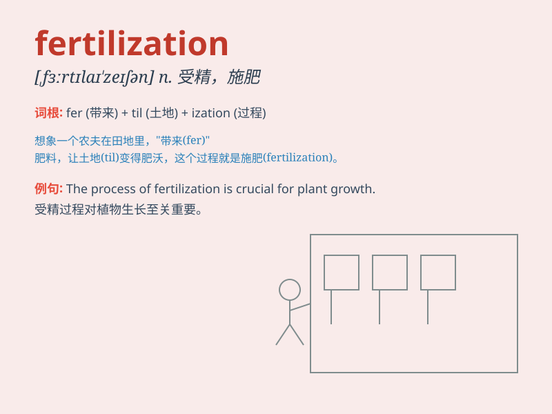

## fertilization

**英音:** _[,fɜːtɪlaɪ\'zeɪʃ(ə)n]_ **美音:**
_[,fɝtlə\'zeʃən]_

**译义:** *n.肥沃,施肥,授精*

### 短语

+ **artificial fertilization:** _人工受精_

+ **fertilization rate:** _受精率_

+ **cross fertilization:** _异体受精；异花受精_

+ **in vitro fertilization:** _体外受精；试管内受精_

+ **self-fertilization:** _自花受精；自体受精_

### 例句

#### 例句1

> **Fertilization occurs when the sperm meets the egg.**

**中文翻译:** 当精子与卵子相遇时，就会发生受精。

**单词释义:** 受精

#### 例句2

> **The process of fertilization is essential for reproduction.**

**中文翻译:** 受精过程对于繁殖至关重要。

**单词释义:** 受精

#### 例句3

> **Artificial fertilization is sometimes used in agriculture.**

**中文翻译:** 农业有时使用人工施肥。

**单词释义:** 受精

### 背诵小故事

> A farmer was very worried because his land lacked fertilization. But
one day, he found a magic potion that provided the necessary nutrients
for fertilization. Soon, his crops grew vigorously.

**一位农民非常担忧，因为他的土地缺乏施肥。但有一天，他发现了一种神奇的药水，为土地提供了必要的施肥养分。很快，他的庄稼茁壮成长。**

### 图义

