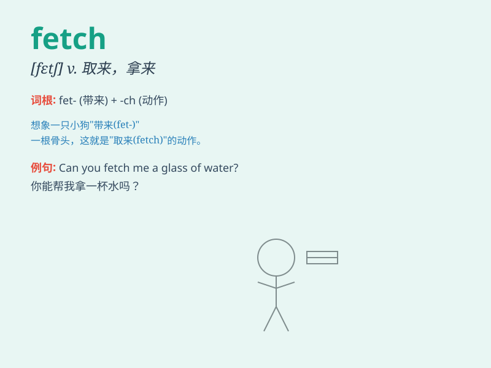

## fetch

**英音:** _[fetʃ]_ **美音:** _[fɛtʃ]_

**译义:**
*vt.接来,取来,带来,售得,引出,吸引,到达,演绎出vi.取物,绕道而行n.取得,拿,诡计,魂*

### 短语

+ **fetch water:** _打水_

+ **fetch and carry:** _打杂，做杂务_

+ **fetch out:** _拿出，引出_

+ **fetch up:** _到达，突然停止_

+ **fetch home:** _击中要害_

### 例句

#### 例句1

> **Could you please fetch me a glass of water?**

**中文翻译:** 你能给我拿一杯水吗？

**单词释义:** 拿来，取来

#### 例句2

> **The dog fetched the stick that was thrown far away.**

**中文翻译:** 狗把扔得很远的棍子叼了回来。

**单词释义:** 取回，接回

#### 例句3

> **This new product is expected to fetch a high price in the
market.**

**中文翻译:** 这种新产品预计在市场上能卖个高价。

**单词释义:** 售得，卖得（某价钱）

### 背诵小故事

> A dog was sent by its owner to fetch a stick. It ran happily, found
the stick, and brought it back. The action of the dog going, getting and
returning is like \'fetch\'.

**一只狗被主人派去取一根棍子。它欢快地跑过去，找到了棍子，并把它带了回来。狗去、拿到然后返回的这个动作就像\'fetch\'的意思。**

### 图义

