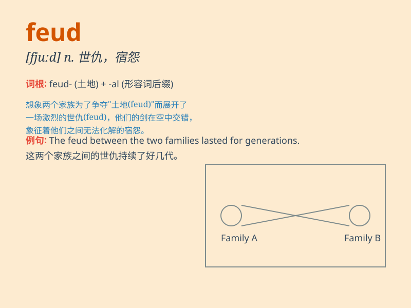

## feud

**英音:** _[fjuːd]_ **美音:** _[fjʊd]_

**译义:**
*n.不和,(部落或家族间的)世仇,封地,争执vi.长期不和,长期争斗*

### 短语

+ **family feud:** _家族世仇_

+ **blood feud:** _血海深仇_

+ **feud with someone:** _与某人结仇_

+ **long-standing feud:** _长期的不和_

+ **settle a feud:** _解决争端_

### 例句

#### 例句1

> **The two families have been involved in a bitter feud for
years.**

**中文翻译:** 这两个家族多年来一直深陷激烈的世仇之中。

**单词释义:** 长期不和；世仇

#### 例句2

> **There was a feud between the two colleagues over a promotion.**

**中文翻译:** 这两位同事因为一次晋升而产生了争执。

**单词释义:** 争执；争吵

#### 例句3

> **The feud between the two gangs has led to several violent
incidents.**

**中文翻译:** 这两个帮派之间的纷争已导致了几起暴力事件。

**单词释义:** 纷争；冲突

### 背诵小故事

> In a small village, two families had a feud. They argued and fought
over a piece of land. The feud lasted for years, making everyone
unhappy. But finally, they decided to talk and solve the problem
peacefully.

**在一个小村庄里，两个家庭有世仇。他们为了一块土地争吵和打斗。这场世仇持续了多年，让每个人都不开心。但最后，他们决定谈谈，和平解决问题。**

### 图义

