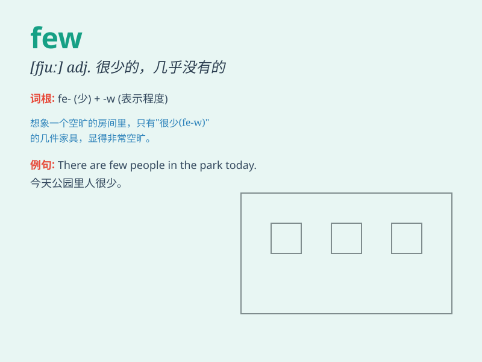

## few

**英音:** _[fjuː]_ **美音:** _[fju]_

**译义:** *adj.很少的,不多的,少数的n.[表示否定]很少数,几乎没有*

### 短语

+ **a few:** _几个；一些_

+ **quite a few:** _相当多；不少_

+ **only a few:** _只有几个；为数不多_

+ **very few:** _极少数；非常少_

+ **few and far between:** _稀少；罕见_

### 例句

#### 例句1

> **Few people understand the true meaning of love.**

**中文翻译:** 很少有人理解爱的真正含义。

**单词释义:** 很少的；几乎没有的

#### 例句2

> **He has few friends because he is so shy.**

**中文翻译:** 他因为太害羞所以朋友很少。

**单词释义:** 很少的；不多的

#### 例句3

> **There are few apples left in the basket.**

**中文翻译:** 篮子里剩下的苹果很少了。

**单词释义:** 很少的；不多的

### 背诵小故事

> Once upon a time, there was a big party. But only a few people showed
up. They were so lonely. It made everyone understand that \'few\' means
a small number.

**从前有一个盛大的聚会。但只有几个人到场了。他们非常孤独。这让每个人都明白'few'意思是少量的。**

### 图义

