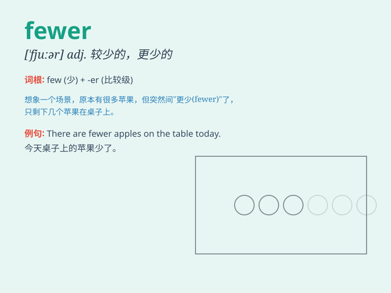

## fewer

**英音:** _[\'fjuːə]_ **美音:** _[\'fjʊɚ]_

**译义:** *int.较少数adj.较少的*

### 短语

+ **fewer people:** _更少的人_

+ **fewer mistakes:** _更少的错误_

+ **fewer opportunities:** _更少的机会_

+ **fewer resources:** _更少的资源_

+ **fewer problems:** _更少的问题_

### 例句

#### 例句1

> **There are fewer people in the room than yesterday.**

**中文翻译:** 房间里的人比昨天少。

**单词释义:** 较少的

#### 例句2

> **Fewer students came to the party this time.**

**中文翻译:** 这次来参加聚会的学生更少了。

**单词释义:** 更少的

#### 例句3

> **We need to buy fewer apples because there aren\'t many
guests.**

**中文翻译:** 我们需要买更少的苹果，因为客人不多。

**单词释义:** 较少数量的

### 背诵小故事

> A king had many apples. But one day, some apples were lost. Now he
had fewer apples than before. He was sad and decided to find out why.
Fewer means a smaller number.

**一位国王有很多苹果。但是有一天，一些苹果丢失了。现在他拥有的苹果比以前更少了。他很伤心并决定找出原因。fewer
意思是数量更少。**

### 图义

