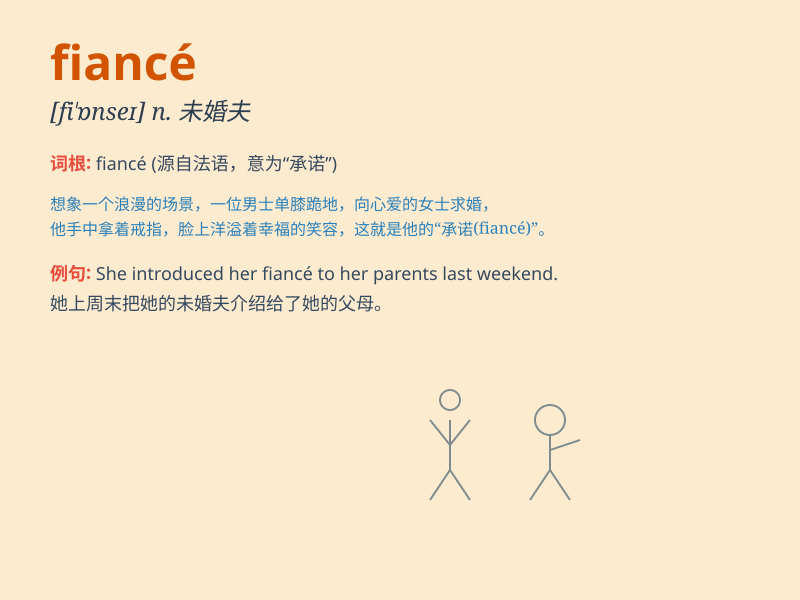

## fiance

**英音:** _[fɪˈɒnseɪ; fɪˈɑːnseɪ]_ **美音:** _[ˌfiɑnˈse;
fiˈɑnˌse; ˈfiɑnˌse]_

**译义:** *n.\<法>未婚夫*

### 短语

+ **fiance\'s family:** _未婚夫的家庭_

+ **future fiance:** _未来的未婚夫_

+ **meet the fiance:** _见未婚夫_

+ **fiance\'s proposal:** _未婚夫的求婚_

+ **fiance\'s job:** _未婚夫的工作_

### 例句

#### 例句1

> **My fiance and I are planning our wedding.**

**中文翻译:** 我的未婚夫和我正在计划我们的婚礼。

**单词释义:** 未婚夫

#### 例句2

> **I introduced my fiance to my parents last weekend.**

**中文翻译:** 上周末我把我的未婚夫介绍给了我的父母。

**单词释义:** 未婚夫

#### 例句3

> **Her fiance bought her a beautiful ring.**

**中文翻译:** 她的未婚夫给她买了一枚漂亮的戒指。

**单词释义:** 未婚夫

### 背诵小故事

> A girl was very excited as her boyfriend proposed and became her
fiance. She imagined their future together, filled with love and
happiness. From that day on, she always called him her fiance with a big
smile.

**一个女孩非常兴奋，因为她的男朋友求婚了，成为了她的未婚夫。她想象着他们充满爱和幸福的未来。从那天起，她总是面带微笑地称他为未婚夫。**

### 图义

