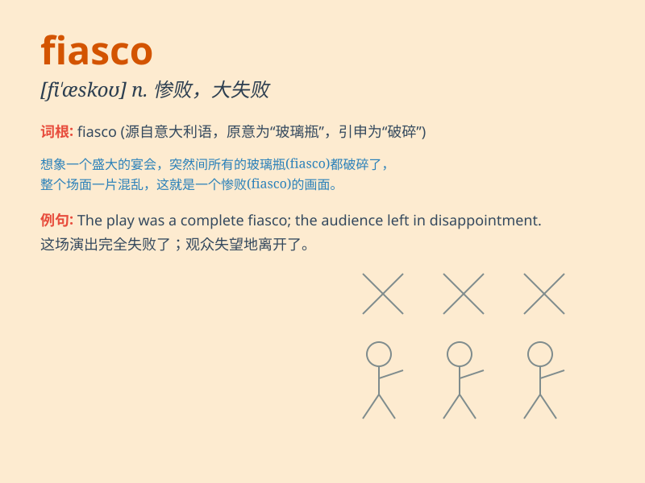

## fiasco

**英音:** _[fɪ\'æskəʊ]_ **美音:** _[fɪ\'æsko]_

**译义:** *n.惨败,大失败,可耻的下场*

### 短语

+ **complete fiasco:** _彻底的失败_

+ **political fiasco:** _政治上的惨败_

+ **public fiasco:** _公开的惨败_

+ **avoid a fiasco:** _避免惨败_

+ **result in a fiasco:** _导致惨败_

### 例句

#### 例句1

> **The party was a complete fiasco. **

**中文翻译:** 这次聚会是个彻头彻尾的失败。

**单词释义:** 惨败；彻底失败

#### 例句2

> **The project turned into a fiasco due to poor planning. **

**中文翻译:** 由于计划不周，这个项目变成了一场惨败。

**单词释义:** 大败；崩溃

#### 例句3

> **His attempt to start a new business ended in a fiasco. **

**中文翻译:** 他尝试开展新业务，最终以失败告终。

**单词释义:** 失败；大溃败

### 背诵小故事

>
想象一下，一位厨师准备了一场盛大的晚宴，结果所有的菜都烧焦了，客人非常不满。这场晚宴成了一个彻底的失败，这就是
fiasco 。就像这场糟糕的晚宴，fiasco 表示惨败、彻底的失败。

**想象一位厨师准备晚宴失败的场景来辅助记忆 fiasco
这个表示惨败、彻底失败的单词**

### 图义

