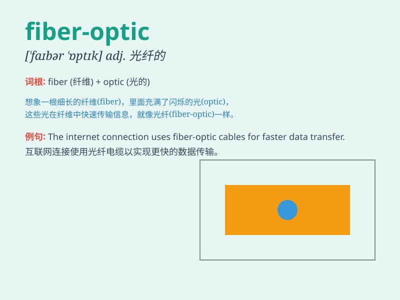

## fiber-optic

**英音:** _[ˌfaɪbə ˈɒptɪk]_ **美音:** _[ˌfaɪbər
ˈɑːptɪk]_

**译义:** *adj. 光纤的；纤维光学的*

### 短语

+ **fiber-optic cable:** _光纤电缆_

+ **fiber-optic communication:** _光纤通信_

+ **fiber-optic sensor:** _光纤传感器_

+ **fiber-optic network:** _光纤网络_

+ **fiber-optic technology:** _光纤技术_

### 例句

#### 例句1

> **The fiber-optic cable provides extremely fast internet
connection.**

**中文翻译:** 光纤电缆提供了极快的互联网连接。

**单词释义:** 光纤的

#### 例句2

> **We are upgrading our network to a fiber-optic system.**

**中文翻译:** 我们正在将我们的网络升级到光纤系统。

**单词释义:** 光纤的

#### 例句3

> **The fiber-optic technology has revolutionized communication.**

**中文翻译:** 光纤技术已经彻底改变了通信方式。

**单词释义:** 光纤的

### 背诵小故事

>
想象一下，未来城市里到处都是像头发丝一样细的纤维（fiber），它们能够传递光信号，让信息飞速传播。这些神奇的纤维组成了光学的网络，这就是
fiber-optic，即'光纤'。

**想象未来城市中纤细的纤维传递光信号形成光学网络来辅助记忆'光纤'这个单词**

### 图义

