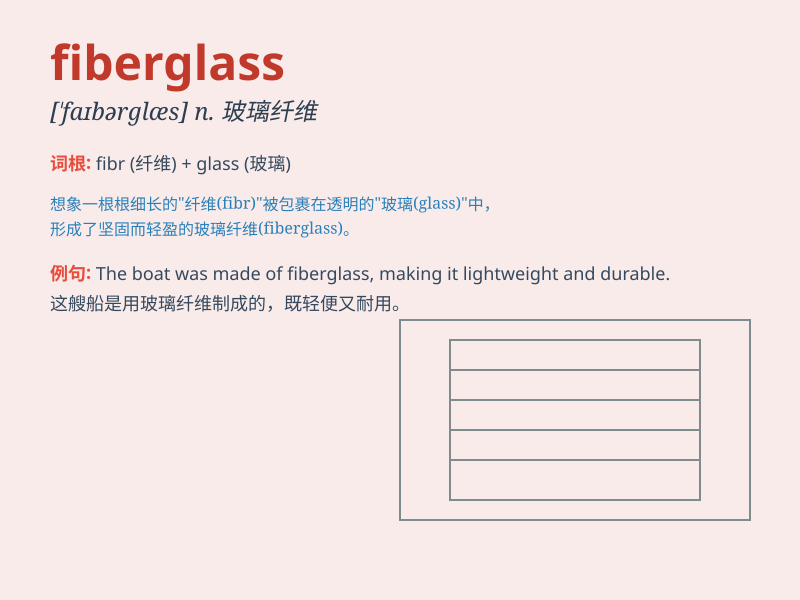

## fiberglass

**英音:** _[ˈfaɪbəglɑːs]_ **美音:** _[ˈfaɪbərˌglæs]_

**译义:** *n.玻璃纤维,玻璃丝*

### 短语

+ **fiberglass insulation:** _玻璃纤维绝缘材料_

+ **fiberglass fabric:** _玻璃纤维织物_

+ **fiberglass reinforced plastic:** _玻璃纤维增强塑料_

+ **fiberglass sheet:** _玻璃纤维薄板_

+ **fiberglass mat:** _玻璃纤维毡_

### 例句

#### 例句1

> **The boat was made of fiberglass and was very durable.**

**中文翻译:** 这艘船是由玻璃纤维制成的，非常耐用。

**单词释义:** 玻璃纤维

#### 例句2

> **The roof was reinforced with fiberglass to withstand strong
winds.**

**中文翻译:** 屋顶用玻璃纤维加固以抵御强风。

**单词释义:** 玻璃纤维

#### 例句3

> **She wore a protective suit made of fiberglass when working in the
factory.**

**中文翻译:** 她在工厂工作时穿着一件玻璃纤维制成的防护服。

**单词释义:** 玻璃纤维

### 背诵小故事

> One day, a scientist was working in the lab. He needed a strong and
lightweight material. Suddenly, he thought of fiberglass and used it to
create an amazing invention. Fiberglass made everything possible!

**有一天，一位科学家在实验室工作。他需要一种坚固且轻质的材料。突然，他想到了玻璃纤维，并使用它创造了一个惊人的发明。玻璃纤维让一切成为可能！**

### 图义

