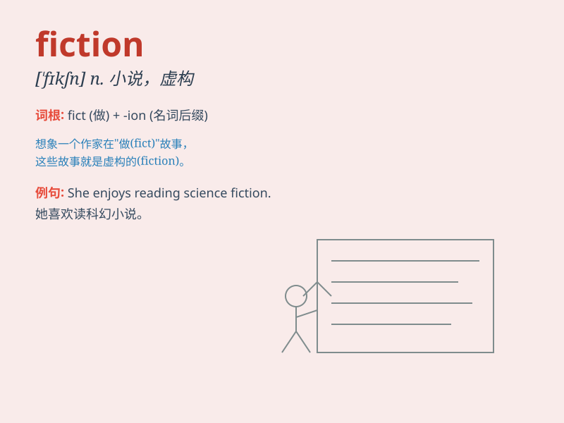

## fiction

**英音:** _[\'fɪkʃ(ə)n]_ **美音:** _[\'fɪkʃən]_

**译义:** *n.虚构,编造,小说*

### 短语

+ **science fiction:** _科幻小说_

+ **historical fiction:** _历史小说_

+ **crime fiction:** _犯罪小说_

+ **fiction writer:** _小说作家_

+ **fan fiction:** _同人小说_

### 例句

#### 例句1

> **Science fiction often explores imaginative concepts and future
technologies.**

**中文翻译:** 科幻小说经常探索富有想象力的概念和未来的技术。

**单词释义:** 小说；虚构的事

#### 例句2

> **Her story was pure fiction and had no basis in reality.**

**中文翻译:** 她的故事纯属虚构，没有现实依据。

**单词释义:** 虚构；编造

#### 例句3

> **The film is based on a work of fiction by a famous author.**

**中文翻译:** 这部电影是根据一位著名作家的一部虚构作品改编的。

**单词释义:** 虚构的作品

### 背诵小故事

> A boy loved to tell stories. One day, he made up a tale about a magic
land. His friends were amazed. But he said, \'This is fiction, not
real!\' It means imaginary things.

**一个男孩喜欢讲故事。有一天，他编了一个关于魔法之地的故事。他的朋友们很惊讶。但他说：'这是虚构，不是真的！'意思是想象出来的东西。**

### 图义

