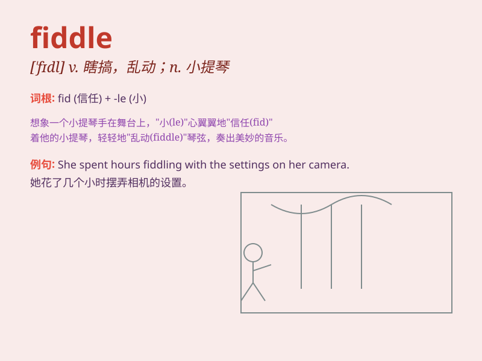

## fiddle

**英音:** _[\'fɪd(ə)l]_ **美音:** _[\'fɪdl]_

**译义:**
*n.小提琴,无意识而不停地拨弄vt.虚度时光,拉小提琴vi.拉小提琴,瞎搞*

### 短语

+ **fiddle around:** _闲荡；虚度光阴；瞎摆弄_

+ **fiddle with:** _摆弄；乱动；玩弄_

+ **second fiddle:** _次要地位；配角_

+ **fit as a fiddle:** _非常健康_

+ **play second fiddle:** _居次要地位；当副手_

### 例句

#### 例句1

> **She fiddled with her hair while waiting.**

**中文翻译:** 她在等待的时候摆弄着头发。

**单词释义:** 摆弄，拨弄

#### 例句2

> **He was accused of fiddling the accounts.**

**中文翻译:** 他被指控篡改账目。

**单词释义:** 篡改，伪造

#### 例句3

> **Stop fiddling and get on with your work!**

**中文翻译:** 别瞎弄了，继续干活！

**单词释义:** 瞎弄，胡搞

### 背诵小故事

> One day, a little mouse was playing a fiddle in the forest. Its
beautiful music attracted many animals. The mouse was so happy and kept
fiddling. Remember, \'fiddle\' means to play the violin in a casual or
unskilled way.

**有一天，一只小老鼠在森林里拉小提琴。它美妙的音乐吸引了许多动物。老鼠非常开心，一直拉着。记住，\'fiddle\'意思是以随意或不熟练的方式拉小提琴。**

### 图义

