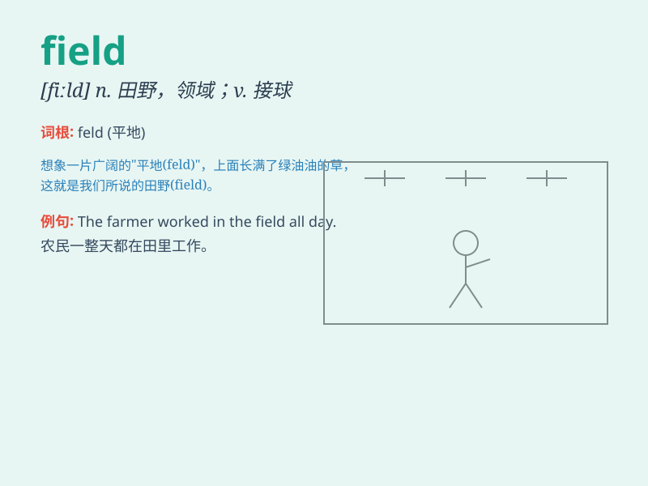

## field

**英音:** _[fiːld]_ **美音:** _[fild]_

**译义:**
*n.原野,旷野,领域,(一块)田地,牧场,域,战场,运动场vt.把(谷物等)暴晒于场上,使上场vi.担任场外队员adj.田间的,野生的,野外的,田赛的
扫描场*

### 短语

+ **field trip:** _实地考察旅行_

+ **oil field:** _油田_

+ **football field:** _足球场_

+ **crop field:** _农田_

+ **battle field:** _战场_

### 例句

#### 例句1

> **The farmer is working in the field.**

**中文翻译:** 这位农民正在地里干活。

**单词释义:** 田地；农田

#### 例句2

> **He is an expert in the field of medicine.**

**中文翻译:** 他是医学领域的专家。

**单词释义:** 领域；专业

#### 例句3

> **The football team won the game on their home field.**

**中文翻译:** 这支足球队在他们的主场赢得了比赛。

**单词释义:** 场地

### 背诵小故事

> One sunny day, I went to a large field. There were colorful flowers
and cute rabbits. I ran and played in the field, feeling so happy and
free. The field was like a big playground for me.

**在一个阳光明媚的日子，我去了一大片田野。那里有五颜六色的花和可爱的兔子。我在田野里奔跑玩耍，感到非常开心和自由。这片田野对我来说就像一个大操场。**

### 图义

