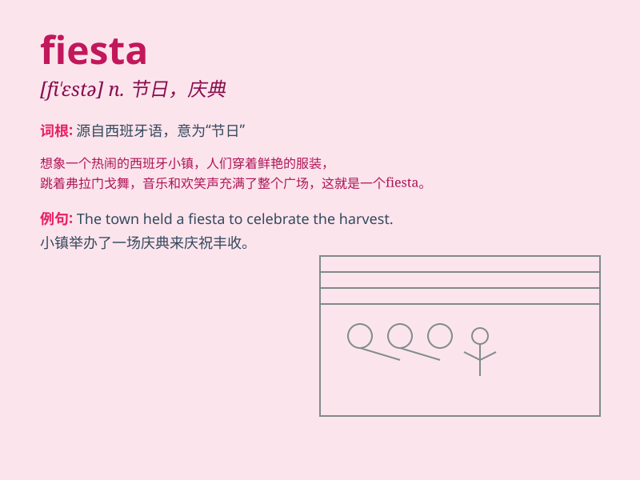

## fiesta

**英音:** _[fɪ\'estə]_ **美音:** _[fɪ\'ɛstə]_

**译义:**
*n.\<西>节日(特指在西班牙和拉丁美洲以游行和舞蹈来庆祝的节日),祭典,圣日,假日*

### 短语

+ **fiesta day:** _节日；庆祝日_

+ **spring fiesta:** _春季狂欢节_

+ **fiesta mood:** _狂欢的心情_

+ **local fiesta:** _当地的节日_

+ **fiesta celebration:** _节日庆典_

### 例句

#### 例句1

> **The town holds a fiesta every year to celebrate its founding.**

**中文翻译:** 这个城镇每年都会举办一场节日庆典来庆祝其成立。

**单词释义:** 节日；庆祝活动

#### 例句2

> **We had a great time at the fiesta last weekend.**

**中文翻译:** 上周末我们在庆祝活动中度过了愉快的时光。

**单词释义:** 庆祝活动

#### 例句3

> **The fiesta was filled with music, dancing, and delicious
food.**

**中文翻译:** 这个节日充满了音乐、舞蹈和美味的食物。

**单词释义:** 节日

### 背诵小故事

>
想象一下，在一个阳光明媚的小镇上，人们正在举办一场盛大的庆祝活动，有欢快的音乐、美味的食物和热情的舞蹈。这场充满欢乐的聚会就叫做
fiesta，大家都沉浸在喜悦中。

**想象在小镇举办的欢乐庆祝活动来记住'fiesta'这个表示节日、聚会的单词**

### 图义

