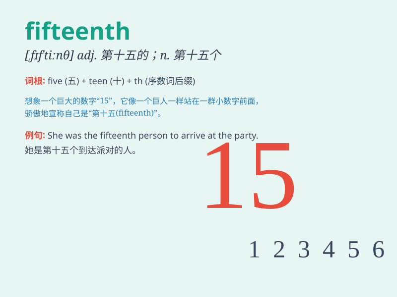

## fifteenth

**英音:** _[fɪf\'tiːnθ]_ **美音:** _[\'fɪf\'tinθ]_

**译义:** *adj.第十五的*

### 短语

+ **the fifteenth day:** _第十五天_

+ **fifteenth anniversary:** _十五周年纪念日_

+ **on the fifteenth:** _在十五日_

+ **fifteenth floor:** _第十五层_

+ **the fifteenth century:** _十五世纪_

### 例句

#### 例句1

> **Today is the fifteenth of July.**

**中文翻译:** 今天是七月十五日。

**单词释义:** 第十五

#### 例句2

> **He ranked fifteenth in the competition.**

**中文翻译:** 他在比赛中排名第十五。

**单词释义:** 第十五

#### 例句3

> **The fifteenth chapter of this book is very interesting.**

**中文翻译:** 这本书的第十五章非常有趣。

**单词释义:** 第十五

### 背诵小故事

> The king\'s birthday was on the fifteenth of the month. Everyone
prepared gifts. A poor boy had no money but made a beautiful card. When
he presented it, the king was very happy.

**国王的生日在这个月的第十五天。每个人都准备了礼物。一个贫穷的男孩没有钱，但制作了一张漂亮的卡片。当他呈上时，国王非常高兴。**

### 图义

