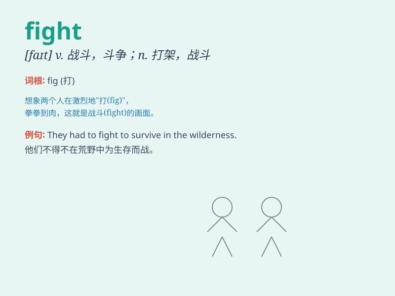

## fight

**英音:** _[faɪt]_ **美音:** _[faɪt]_

**译义:**
*n.打架,战斗,斗志vi.打仗,搏斗,对抗,打架vt.与\...打仗,指挥战斗,反对\...提案*

### 短语

+ **fight back:** _反击；抵抗_

+ **fight off:** _击退；竭力摆脱_

+ **fight out:** _通过争斗解决_

+ **put up a fight:** _奋勇抵抗_

+ **fight for:** _为\...而战；争取_

### 例句

#### 例句1

> **They had a fierce fight over the inheritance.**

**中文翻译:** 他们为遗产展开了激烈的争斗。

**单词释义:** 争斗；斗争

#### 例句2

> **The soldiers are ready to fight for their country.**

**中文翻译:** 士兵们准备为他们的国家而战。

**单词释义:** 战斗；作战

#### 例句3

> **She had to fight against her fear to perform on stage.**

**中文翻译:** 她不得不克服恐惧在舞台上表演。

**单词释义:** 对抗；与\...\...作斗争

### 背诵小故事

> One day, a brave knight was on his way home when he saw a monster
attacking a village. Without hesitation, he decided to fight the
monster. With his strong skills and courage, he finally defeated it and
saved the villagers.

**有一天，一位勇敢的骑士在回家的路上看到一只怪物正在攻击一个村庄。他毫不犹豫地决定与怪物战斗。凭借他强大的技能和勇气，他最终打败了它，拯救了村民。**

### 图义

