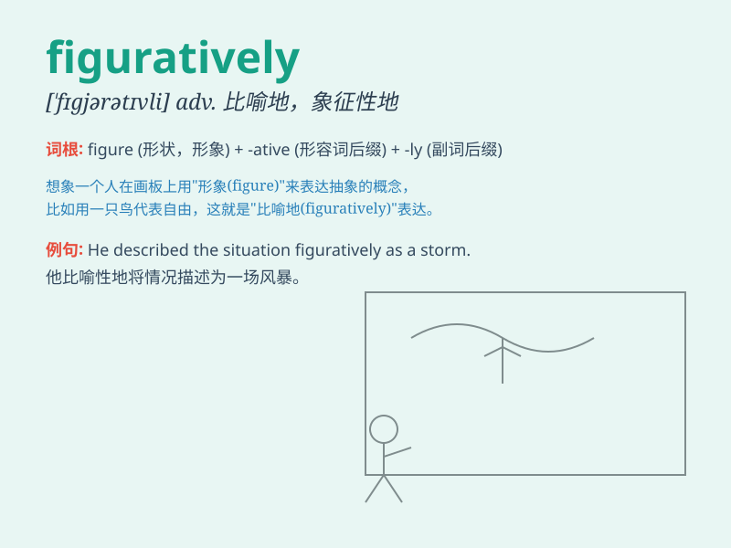

## figuratively

**英音:** _[\'fɪɡərətɪvli]_ **美音:** _[\'fɪɡjərətɪvli]_

**译义:** *adv.比喻地,象征性地*

### 短语

+ **speak figuratively:** _打比方说；用比喻的方式说_

+ **explain figuratively:** _用比喻来解释_

+ **describe figuratively:** _用比喻来描述_

+ **think figuratively:** _形象地思考_

+ **express figuratively:** _用比喻表达_

### 例句

#### 例句1

> **He spoke figuratively when he described the journey as a wild
adventure.**

**中文翻译:** 当他把这次旅行描述为一次疯狂的冒险时，他是在打比方说。

**单词释义:** 打比方地；比喻地

#### 例句2

> **The phrase \'time is money\' is often used figuratively to
emphasize the value of time.**

**中文翻译:**
'时间就是金钱'这个短语经常被比喻性地使用，以强调时间的价值。

**单词释义:** 形象地；比喻性地

#### 例句3

> **Figuratively speaking, her heart was broken into pieces.**

**中文翻译:** 打个比方说，她的心碎成了一片片。

**单词释义:** 形象地；用比喻的方法

### 背诵小故事

> Once upon a time, a painter used colors Figuratively to express
emotions. Instead of depicting real scenes, he used abstract forms. This
showed that Figuratively means not literally but in a way that uses
figures of speech or symbolic representation.

**从前，有一位画家运用色彩以比喻的方式来表达情感。他并非描绘真实的场景，而是使用抽象的形式。这表明figuratively意为不是字面上的，而是以使用修辞或象征表示的方式。**

### 图义

