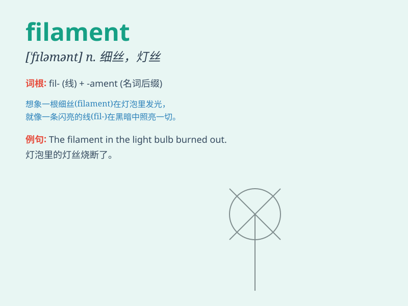

## filament

**英音:** _[\'fɪləm(ə)nt]_ **美音:** _[\'fɪləmənt]_

**译义:** *n.细丝,灯丝*

### 短语

+ **filament lamp:** _白炽灯_

+ **filament winding:** _纤维缠绕_

+ **heating filament:** _加热丝_

+ **filament current:** _灯丝电流_

+ **tungsten filament:** _钨丝_

### 例句

#### 例句1

> **The filament in the light bulb burned out.**

**中文翻译:** 灯泡里的灯丝烧断了。

**单词释义:** 灯丝

#### 例句2

> **The spider spins a filament to build its web.**

**中文翻译:** 蜘蛛吐出细丝来织网。

**单词释义:** 细丝

#### 例句3

> **The plant has delicate filaments on its leaves.**

**中文翻译:** 这种植物的叶子上有纤细的丝状物。

**单词释义:** 丝状物

### 背诵小故事

>
想象一下，在一个古老的实验室里，有一根像头发丝一样细的线，它能发出神秘的光芒。科学家们称它为
\'filament\' ，它是灯泡里的关键部分，负责让灯泡亮起来。

**想象在古老实验室里，有一根如发丝细且能发光的线被科学家称为\'filament\'，它是灯泡关键部件。**

### 图义

