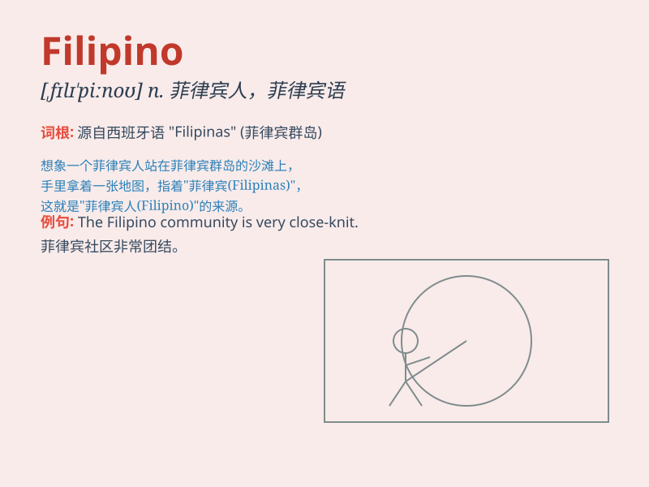

## Filipino

**英音:** _[ˌfɪlɪˈpiːnəʊ]_ **美音:** _[ˌfɪlɪˈpiːnoʊ]_

**译义:** *n. 菲律宾人；adj. 菲律宾的；菲律宾人的*

### 短语

+ **Filipino cuisine:** _菲律宾美食_

+ **Filipino language:** _菲律宾语_

+ **Filipino culture:** _菲律宾文化_

+ **Filipino people:** _菲律宾人_

+ **Filipino music:** _菲律宾音乐_

### 例句

#### 例句1

> **The Filipino cuisine is known for its rich flavors and unique
ingredients.**

**中文翻译:** 菲律宾美食以其丰富的口味和独特的食材而闻名。

**单词释义:** 菲律宾的；菲律宾人的

#### 例句2

> **She has many Filipino friends who are very friendly.**

**中文翻译:** 她有很多非常友好的菲律宾朋友。

**单词释义:** 菲律宾的；菲律宾人的

#### 例句3

> **The Filipino language is widely spoken in the Philippines.**

**中文翻译:** 菲律宾语在菲律宾被广泛使用。

**单词释义:** 菲律宾的；菲律宾人的；菲律宾语

### 背诵小故事

> A Filipino chef was famous for his unique cooking. One day, a tourist
tasted his dish and was amazed. The chef said, \'This is the taste of
Filipino cuisine!\'

**一位菲律宾厨师因其独特的厨艺而出名。有一天，一位游客品尝了他的菜肴并感到惊叹。厨师说：'这就是菲律宾美食的味道！'**

### 图义

