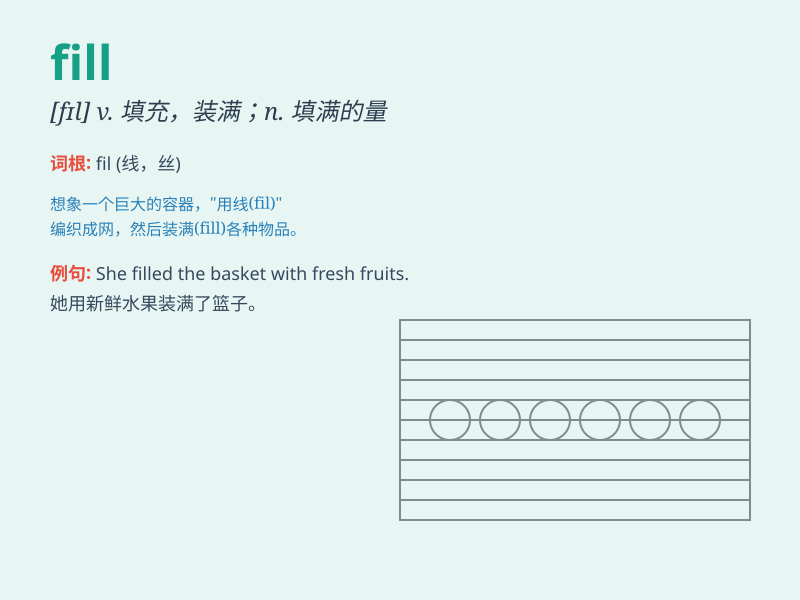

## fill

**英音:** _[fɪl]_ **美音:** _[fɪl]_

**译义:**
*vt.装满,注满,充满,填充,弥漫,供应,供给,满足vi.充满n.满足,饱,充分,填方v.填充*

### 短语

+ **fill in:** _填写；填充；替代_

+ **fill out:** _填写；长胖；充实_

+ **fill up:** _装满；填满；充满_

+ **fill with:** _使充满；用......装满_

+ **be filled with:** _充满；装满_

### 例句

#### 例句1

> **Please fill the glass with water.**

**中文翻译:** 请把杯子装满水。

**单词释义:** 使充满；装满

#### 例句2

> **The doctor will fill out a form for you.**

**中文翻译:** 医生会为你填写一份表格。

**单词释义:** 填写

#### 例句3

> **Her eyes filled with tears when she heard the news.**

**中文翻译:** 当她听到这个消息时，她的眼里充满了泪水。

**单词释义:** 充满；布满

### 背诵小故事

> A little girl had an empty vase. She went to the garden and picked
many beautiful flowers to fill the vase. Now the vase was full of colors
and joy.

**一个小女孩有一个空花瓶。她去花园摘了许多漂亮的花来填满花瓶。现在花瓶充满了色彩和欢乐。**

### 图义

