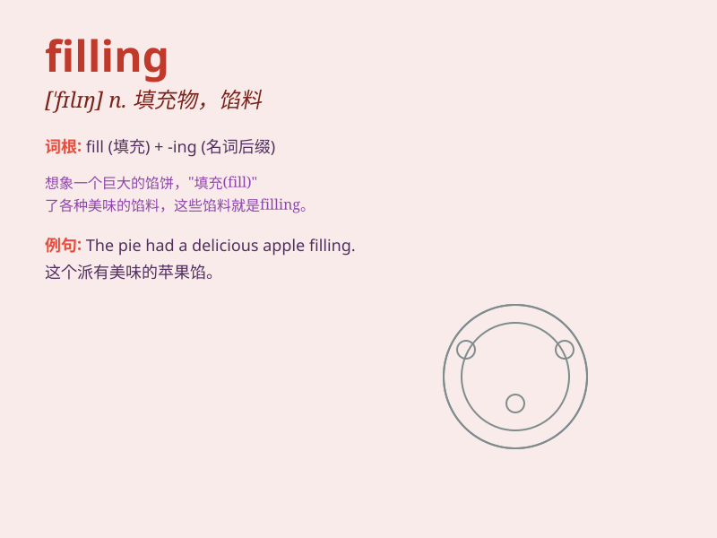

## filling

**英音:** _[\'fɪlɪŋ]_ **美音:** _[\'fɪlɪŋ]_

**译义:** *n.填补物,饼馅,纬纱,填充,供应*

### 短语

+ **filling station:** _加油站_

+ **filling material:** _填充材料_

+ **filling machine:** _灌装机；充填机_

+ **filling cabinet:** _档案柜_

+ **filling lunch:** _丰盛的午餐_

### 例句

#### 例句1

> **The dentist is doing a filling for my tooth.**

**中文翻译:** 牙医正在给我的牙齿补牙。

**单词释义:** 补牙材料；填充物

#### 例句2

> **The filling in the sandwich was very delicious.**

**中文翻译:** 三明治里的馅料非常美味。

**单词释义:** （食品的）馅；填充物

#### 例句3

> **The filling of the form took me a long time.**

**中文翻译:** 填写这份表格花了我很长时间。

**单词释义:** 填写；填充

### 背诵小故事

> One day, I went to a bakery. The baker was busy with filling cream
into the cakes. The filling made the cakes look so delicious. I
couldn\'t wait to taste them.

**有一天，我去了一家面包店。面包师正忙着把奶油填进蛋糕里。这些馅料让蛋糕看起来十分美味。我迫不及待想尝尝。**

### 图义

