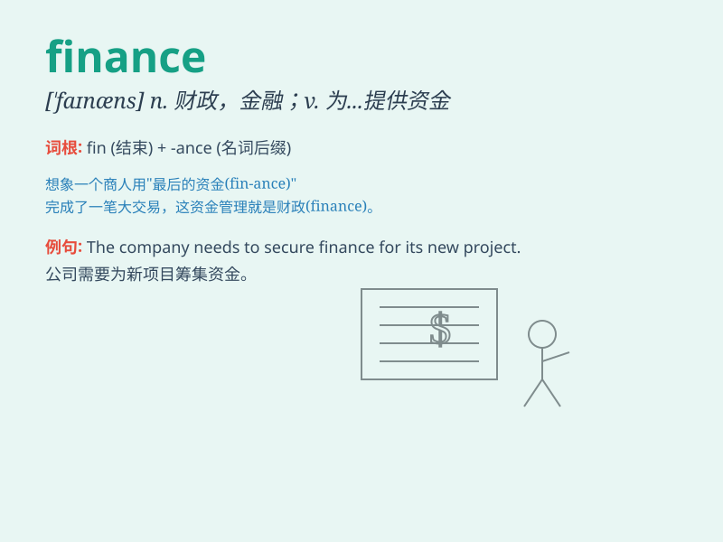

## finance

**英音:** _[\'faɪnæns; faɪ\'næns; fɪ-]_ **美音:**
_[\'faɪnæns]_

**译义:** *n.财政,金融,财政学vt.供给\...经费,负担经费vi.筹措资金*

### 短语

+ **public finance:** _公共财政_

+ **corporate finance:** _公司财务_

+ **international finance:** _国际金融_

+ **finance minister:** _财政部长_

+ **project finance:** _项目融资_

### 例句

#### 例句1

> **The company\'s finance department is responsible for budgeting
and financial planning.**

**中文翻译:** 这家公司的财务部门负责预算和财务规划。

**单词释义:** 财务；金融

#### 例句2

> **He has a good understanding of finance and investment.**

**中文翻译:** 他对金融和投资有很好的理解。

**单词释义:** 金融；财政

#### 例句3

> **We need to finance the project through external sources.**

**中文翻译:** 我们需要通过外部渠道为这个项目筹集资金。

**单词释义:** 为\...\...提供资金

### 背诵小故事

> A young entrepreneur struggled to start a business. But with the help
of finance experts, he got loans and managed his money wisely. Finally,
his business thrived. Finance was the key to his success!

**一位年轻的企业家努力创业。但在金融专家的帮助下，他获得了贷款并明智地管理资金。最终，他的企业蓬勃发展。金融是他成功的关键！**

### 图义

