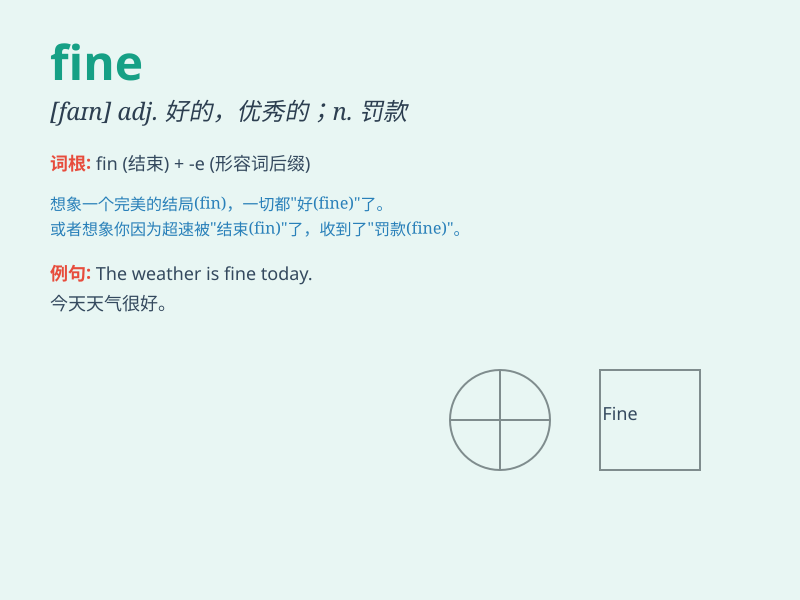

## fine

**英音:** _[faɪn]_ **美音:** _[faɪn]_

**译义:**
*adj.美好的,优良的,杰出的,精美的,杰出的,细,纤细,纯粹n.罚款,罚金,晴天,精细vt.罚款,精炼,澄清vi.变清,变细adv.\<口>很好,妙,[常用于构成复合词]细微地,精巧地*

### 短语

+ **fine art:** _美术；艺术（包括绘画、雕塑、建筑等）_

+ **fine print:**
_（契约中）难懂的条文；（通常指）附加的但重要的规定_

+ **fine weather:** _好天气_

+ **cut it fine:** _（做某事）时间扣得很紧；几乎不留余地_

+ **in fine:** _最后；总之_

### 例句

#### 例句1

> **The weather is fine today.**

**中文翻译:** 今天天气很好。

**单词释义:** 好的；晴朗的

#### 例句2

> **She has a fine figure.**

**中文翻译:** 她身材很好。

**单词释义:** 美好的；优秀的

#### 例句3

> **You\'ll get a fine if you park here.**

**中文翻译:** 如果你在这里停车，你会被罚款。

**单词释义:** 罚款

### 背诵小故事

> One day, a little boy was lost in the forest. A kind fairy appeared
and said, \'Don\'t worry, you\'ll be fine.\' The boy trusted her and
finally found his way home safely. \'Fine\' here means okay or well.

**有一天，一个小男孩在森林里迷路了。一位善良的仙女出现并说：'别担心，你会没事的。'
男孩相信了她，最终安全地找到了回家的路。这里的'fine'意思是好的，无恙的。**

### 图义

