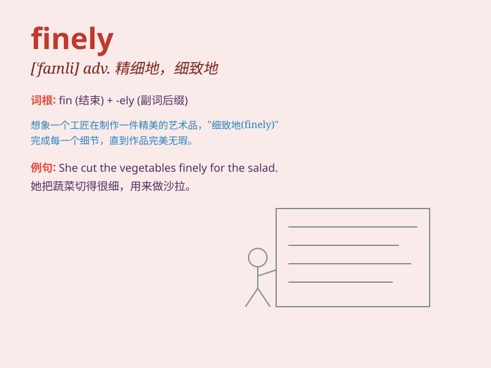

## finely

**英音:** _[\'faɪnlɪ]_ **美音:** _[\'faɪnli]_

**译义:** *adv.细微地,美好地*

### 短语

+ **finely divided:** _细分的；细碎的_

+ **finely ground:** _磨得很细的_

+ **finely tuned:** _精心调整的；微调的_

+ **finely chopped:** _切碎的；剁碎的_

+ **finely crafted:** _精心制作的；制作精巧的_

### 例句

#### 例句1

> **The wood was finely carved.**

**中文翻译:** 这块木头被精雕细刻。

**单词释义:** 精细地；精巧地

#### 例句2

> **The machine is finely tuned.**

**中文翻译:** 这台机器被精细调试。

**单词释义:** 精确地；精密地

#### 例句3

> **She was finely dressed for the party.**

**中文翻译:** 她为聚会精心打扮。

**单词释义:** 精心地；优美地

### 背诵小故事

> Once upon a time, a chef was praised for cutting vegetables finely.
Every slice was perfect, showing his excellent skills. \'Finely\' here
means done in a precise and delicate way.

**从前，有位厨师因把蔬菜切得精细而受到称赞。每一片都完美无缺，展示了他出色的技艺。这里的'finely'意思是以精确和精细的方式完成。**

### 图义

