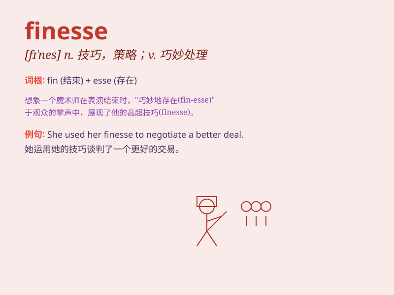

## finesse

**英音:** _[fɪ\'nes]_ **美音:** _[fɪ\'nɛs]_

**译义:**
*n.手腕,精密技巧,灵巧,策略,手段v.用计谋处理,出小牌,用巧计实现*

### 短语

+ **finesse in handling:** _处理中的巧妙手段_

+ **lack of finesse:** _缺乏巧妙_

+ **show finesse:** _展现巧妙_

+ **finesse of style:** _风格的精妙_

+ **master finesse:** _精通巧妙_

### 例句

#### 例句1

> **She handled the difficult situation with finesse.**

**中文翻译:** 她巧妙地处理了这个困难的局面。

**单词释义:** 巧妙的手段；技巧

#### 例句2

> **The chef added the final touches to the dish with finesse.**

**中文翻译:** 这位厨师以精湛的技艺为这道菜做了最后的点缀。

**单词释义:** 精湛的技艺

#### 例句3

> **He negotiated the deal with finesse and got a great outcome.**

**中文翻译:** 他巧妙地协商了这笔交易，并取得了很好的结果。

**单词释义:** 巧妙地处理

### 背诵小故事

> A clumsy thief was always getting caught. One day, he learned
finesse. Instead of rushing, he planned carefully and moved smoothly,
avoiding traps. Finally, he stole the treasure with finesse.

**一个笨手笨脚的小偷总是被抓住。有一天，他学会了技巧。他不再匆忙行事，而是精心计划，行动流畅，避开陷阱。最终，他凭借技巧偷走了宝藏。**

### 图义

