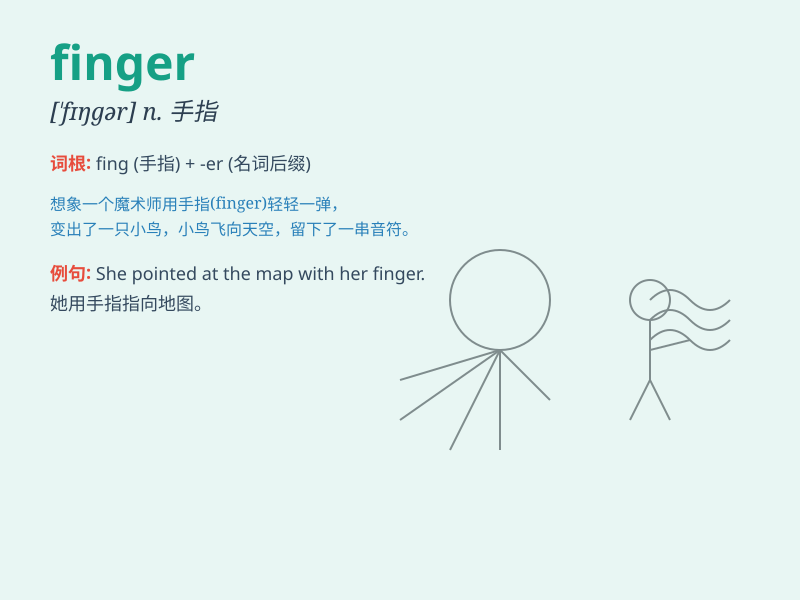

## finger

**英音:** _[\'fɪŋgə]_ **美音:** _[\'fɪŋɡɚ]_

**译义:**
*n.手指(尤指大拇指以外的手指),指状物,指针,查找器(查找因特网用户的程序)v.用手指拨弄,伸出*

### 短语

+ **point the finger at:** _指责；怪罪_

+ **have a finger in the pie:** _多管闲事；插手_

+ **twist someone around one\'s little finger:** _任意摆布某人_

+ **lay a finger on:** _触碰；动手打_

+ **fingerprint:** _指纹；手印_

### 例句

#### 例句1

> **She pointed with her finger.**

**中文翻译:** 她用手指着。

**单词释义:** 手指

#### 例句2

> **He cut his finger while cooking.**

**中文翻译:** 他做饭时割破了手指。

**单词释义:** 手指

#### 例句3

> **The detective examined the fingerprints on the glass.**

**中文翻译:** 侦探检查了玻璃上的指纹。

**单词释义:** 指纹；指印

### 背诵小故事

> One day, a little monkey was playing in the forest. Suddenly, it hurt
its finger when climbing a tree. It cried loudly. But soon, it learned
to be careful and protect its fingers.

**一天，一只小猴子在森林里玩耍。突然，它爬树时弄伤了手指。它大哭起来。但很快，它学会了小心并保护自己的手指。**

### 图义

