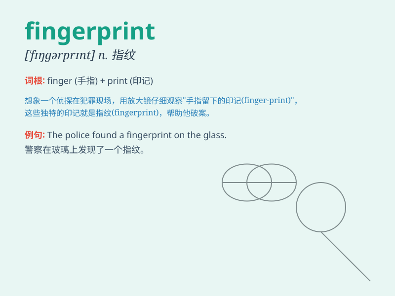

## fingerprint

**英音:** _[\'fɪŋgəprɪnt]_ **美音:** _[\'fɪŋɡɚprɪnt]_

**译义:** *n.指纹,手印vt.采指纹*

### 短语

+ **fingerprint analysis:** _指纹分析_

+ **fingerprint scanner:** _指纹扫描仪_

+ **fingerprint evidence:** _指纹证据_

+ **fingerprint identification:** _指纹识别_

+ **take a fingerprint:** _采集指纹_

### 例句

#### 例句1

> **The police found a fingerprint on the window.**

**中文翻译:** 警察在窗户上发现了一个指纹。

**单词释义:** 指纹

#### 例句2

> **Each person\'s fingerprint is unique.**

**中文翻译:** 每个人的指纹都是独一无二的。

**单词释义:** 指纹

#### 例句3

> **The fingerprint scanner identified the user.**

**中文翻译:** 指纹扫描仪识别了用户。

**单词释义:** 指纹

### 背诵小故事

> One day, a detective was solving a crime. The only clue was a
fingerprint left at the scene. He knew that this fingerprint would be
the key to finding the culprit. Finally, with the help of the
fingerprint, the mystery was solved.

**有一天，一位侦探正在侦破一起犯罪案件。现场唯一的线索是一个指纹。他知道这个指纹将是找到罪犯的关键。最终，在这个指纹的帮助下，谜团被解开了。**

### 图义

