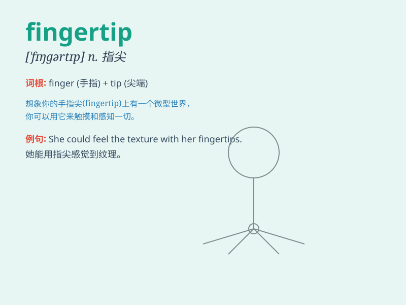

## fingertip

**英音:** _[ˈfɪŋɡətɪp]_ **美音:** _[ˈfɪŋɡərtɪp]_

**译义:** *n.指尖,指套*

### 短语

+ **at one\'s fingertips:** _了如指掌；精通_

+ **have something at one\'s fingertips:**
_对某事熟悉；对某物运用自如_

+ **fingertip control:** _指尖控制_

+ **fingertip search:** _仔细搜索_

+ **fingertip grip:** _指尖抓握_

### 例句

#### 例句1

> **She touched the delicate flower with her fingertip.**

**中文翻译:** 她用指尖触碰那朵娇嫩的花。

**单词释义:** 指尖

#### 例句2

> **He could feel the texture of the fabric just by running his
fingertip over it.**

**中文翻译:** 他仅用指尖在布料上划过就能感觉到其质地。

**单词释义:** 指尖

#### 例句3

> **The pianist played the keys with lightness and precision, using
only her fingertips.**

**中文翻译:** 这位钢琴家仅用指尖轻盈且精准地弹奏琴键。

**单词释义:** 指尖

### 背诵小故事

> One day, a little fairy was lost in a magical forest. She could only
find her way back by touching the trees with her fingertip. Every
fingertip touch brought her closer to home.

**有一天，一个小仙女在魔法森林里迷路了。她只能用指尖触摸树木来找到回家的路。每一次指尖的触碰都让她离家更近。**

### 图义

